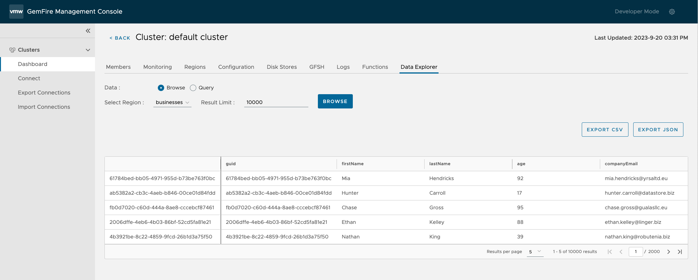
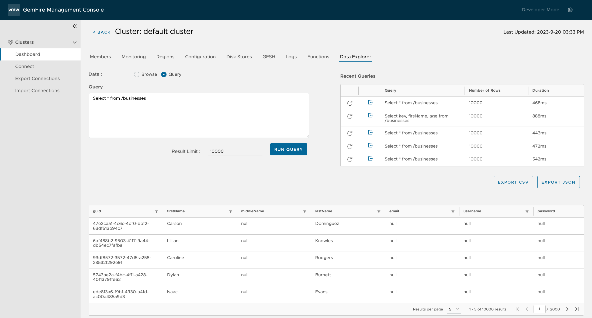

We are thrilled to announce the launch of  [VMware GemFire Management Console version 1.1](https://support.broadcom.com/) available now from the Broadcom Support Portal. This update brings powerful new features to help you manage your GemFire clusters with greater ease and efficiency. In this blog post, we'll explore these exciting enhancements and their potential impact on your GemFire experience.

## What's New in GemFire Management Console 1.1

Let's dive right into the details of this release and explore the new features and improvements.

## Cluster Monitoring 

In the ever-evolving landscape of data management and cluster operations, gaining real-time insights into your GemFire cluster's performance is essential. GemFire Management Console version 1.1 introduces a new “Monitoring” tab, designed to empower developers and operators with a visual window into their cluster's health and efficiency.

These graphs are not just data points; they are your compass in navigating the complexities of GemFire cluster management. With a single glance, you can assess the effectiveness of your data operations, ensure the seamless functioning of your cluster, and maintain the integrity of multi-site setups. 

 *  **Data Metrics:** This section focuses on the heart of your GemFire cluster—its data. It includes key graphs such as data throughput, latency metrics, cache hit ratio, and more. These metrics collectively provide a snapshot of how efficiently your cluster is handling data operations. For instance, data throughput reveals the rate of 'Get' and 'Put' operations, while latency metrics offer insights into the speed of these operations. The cache hit ratio indicates the effectiveness of your cache in returning valid data. These visual representations help you quickly gauge data-related performance and identify areas for improvement.
    
 *  **Cluster Health Metrics:** The cluster health section is all about ensuring the smooth operation of your GemFire cluster. It features graphs like CPU utilization, cluster communication delays, and IO waits. These metrics give you a broader view of your cluster's overall health. CPU utilization percentages for individual members help pinpoint potential bottlenecks, while cluster communication metrics reveal any delays or issues in intra-cluster communication. Monitoring IO waits can highlight instances where cluster performance is affected by external factors. These graphs collectively offer insights into the general well-being of your cluster.
    
 *  **WAN Gateway Metrics (For Multi-Site Setups):** For GemFire clusters involved in multi-site configurations, this section provides valuable data related to WAN (Wide Area Network) communication. It includes graphs like WAN receiver throughput and sender queues. These metrics are essential for maintaining data synchronization and transmission between geographically distributed clusters. WAN receiver throughput shows the rate of data sent and received between clusters, ensuring data consistency. Sender queue metrics indicate the efficiency of event transmission. These insights are particularly crucial for organizations with multi-site deployments, helping them ensure data integrity and synchronization across geographies.

The new monitoring feature aids in simplifying the process of assessing and optimizing your GemFire environment for peak efficiency and reliability.

## Data Explorer

The Data Explorer feature in GemFire Management Console 1.1 offers a powerful toolset for users to efficiently interact with their GemFire cluster's data. It includes Data Browsing and Data Query functionalities, catering to a broad range of user needs and use cases.

**Data Browsing** simplifies data access and exploration within the GemFire cluster. Users can easily select a specific region, define result limits, and swiftly retrieve data. This streamlined process is especially beneficial for managing large datasets, with the results presented in a table format. Users can export this data in CSV or JSON formats, enhancing its usability for offline analysis..

**Data Query** is designed for advanced users and specific data extraction requirements. It allows users to craft custom Object Query Language (OQL) statements to precisely target their desired data. This level of granularity is invaluable when dealing with complex datasets or specialized queries. The query results are displayed in a tabular format, akin to data browsing, and can also be exported in CSV or JSON format for further analysis and utilization.

The Data Explorer feature simplifies data retrieval and exploration, enabling users to swiftly access critical information within their GemFire clusters. Whether it's gaining insights into customer behavior, identifying growth opportunities, or making data-driven decisions, this feature empowers organizations to harness the full potential of their GemFire data, providing a vital resource in today's data-driven landscape.

## Download Logs and Statistics
Users can now easily download logs and statistics from their GemFire clusters. This feature simplifies the data collection process, offers customization options, and enhances issue diagnosis and resolution, ultimately improving the overall management of GemFire clusters.



In traditional scenarios, when diagnosing issues in complex cluster environments, users often have to sift through extensive logs and statistics, potentially containing vast amounts of data that may not be directly relevant to the problem at hand.

Users can now tailor their data exports by choosing between logs, statistics, or both, ensuring they obtain precisely the information relevant to their needs. The ability to select a date and time range enhances data specificity, making it easier to focus on the relevant time frames for analysis. Another key feature is flexible log level filtering, which allows users to hone in on specific severity levels, eliminating unnecessary noise and prioritizing vital insights.

With the GemFire Management Console 1.1's ability to specify GemFire members, users can now pinpoint and retrieve data from the specific cluster members that are relevant to the issue. This means that when troubleshooting or investigating a problem, users can focus solely on the components of the cluster where the issue is suspected to originate.

## Seamless Authentication with Management Console Credentials

In this release, we've taken a significant step forward in enhancing user convenience and security by streamlining the authentication process. With this update, you can now seamlessly access your GemFire clusters using the same credentials you use for the GemFire Management Console itself. This means no more redundant login prompts or the hassle of managing separate sets of credentials. A single login is all it takes to gain access to both the console and your GemFire clusters, simplifying the user experience and saving valuable time.
It's important to note that this seamless authentication experience is contingent on your GemFire cluster employing the same credential system as the GemFire Management Console. When these systems align, you can enjoy a unified login process that enhances not only ease of use but also strengthens security measures, providing a smoother and more efficient workflow for managing your GemFire clusters.

## Cluster Connection Management
Managing cluster connections has never been easier. With GemFire Management Console 1.1, you can now export and import cluster connections with a few clicks, ensuring you have convenient backups and streamlining the setup process when dealing with multiple clusters.
   
   * **Export Cluster Connections:** To safeguard your cluster connections, simply open the cluster menu and select the "Export Cluster" option. Choose the clusters you want to export, and the system will generate a file containing the cluster connection information. 
    

   * **Import Cluster Connections:** Importing cluster connections is equally straightforward. Open the cluster menu and select "Import Cluster." Browse for the exported file, and click import.
    
    
   * **Duplicate Cluster Connections:** Need to replicate a connection setup? Use the new "Duplicate Connection" action under "Actions" in the clusters dashboard. It duplicates all connection information except for passwords and files, saving you valuable setup time.

## Compatability
The GemFire Management Console allows users to view clusters across all GemFire deployment types including

- VMware GemFire: 9.15.x
- VMware GemFire: 10.0.x
- VMware GemFire for TAS: 1.14.5+
- VMware GemFire for Kubernetes: 2.1+  

## Conclusion
GemFire Management Console version 1.1 is a game-changer for developers and operators managing GemFire clusters. With features like cluster monitoring, data exploration, and streamlined cluster connection management, your GemFire experience will be more efficient and insightful than ever before.

## Additional Resources

**Download:** Available now from the [Broadcom Support Portal](https://support.broadcom.com/).

**Documentation:** [GemFire Management Console 1.1 Documentation](https://docs.vmware.com/en/VMware-GemFire-Management-Console/1.1/gfmc/index.html)

**Release Notes:** [GemFire Management Console 1.1 Release Notes](https://docs.vmware.com/en/VMware-GemFire-Management-Console/1.1/gfmc/release_notes.html)