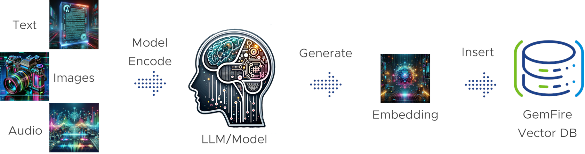
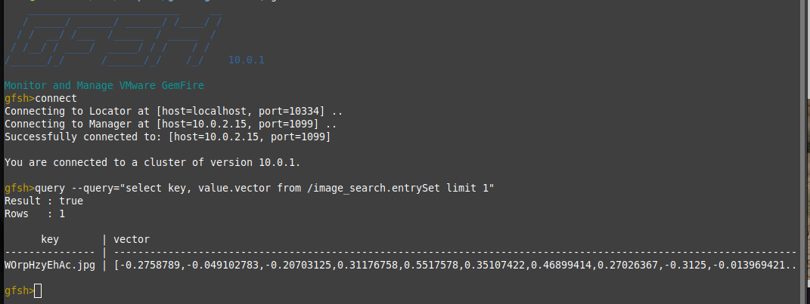
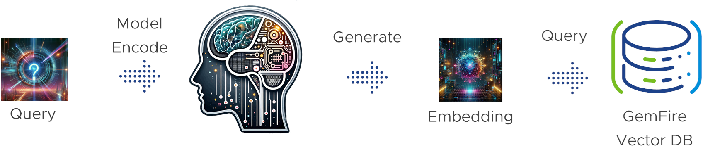

---
title: "Tanzu GemFire Vector Database in Action"
date: "2024-01-18"
lastmod: "2024-01-18"
type: blog
team:
- Charlie Black
- John Martin
description: Discover How GemFire Vector Database Seamlessly Integrates the Robust Performance of GemFire with the Cutting-Edge Realms of AI.  
carouselType: image
carouselImage: images/gemfire-vectordb-logo.png
--- 

Unleash the Fusion of Speed and Intelligence: Discover How GemFire Vector Database Seamlessly Integrates the Robust Performance of GemFire with the Cutting-Edge Realms of AI.  GemFire Vector Database removes any complexities of how to set up AI use cases with GemFire and packages it up in a simple easy to use extension.  So now creating an index, loading data, and querying are simple rest commands.  

If you would like to download GemFire VectorDB, check out the example application, or learn more about GemFire and all the awesome features check out these links:

* [Download the GemFire Vector Database Extension](https://network.tanzu.vmware.com/products/gemfire-vectordb/)
* [GemFire Vector Database Documentation](https://docs.vmware.com/en/VMware-GemFire-VectorDB/1.0/gemfire-vectordb/overview.html)
* [Source Code For GemFire Image Search Demo](https://github.com/gemfire/gemfire-examples/tree/main/extensions/gemfireVectorDatabase/imageSearch) 
* Discover all things GemFire https://gemfire.dev 

## What is GemFire?

Customers across many industries entrust GemFire with their core lines of business for a multitude of reasons.   Customers choose GemFire for the speed, trust, and the intelligence that can be built on top of GemFire.   

**Speed**: GemFire's remarkable speed is a direct result of its advanced architecture, which prioritizes in-memory processes over conventional disk-based approaches. This in memory distinction is critical: consider the difference between an in-memory lock versus a disk-based lock.   An in-memory lock operates directly within the computer's RAM, making it much quicker to access and use compared to a disk-based lock. Disk-based locks rely on the computer's storage drive, which is significantly slower than RAM. This means that acquiring an in-memory lock is much faster than obtaining a disk-based lock. 

The superiority of in-memory processing becomes even more apparent when we extend this comparison across all database functionalities. This holds true even when juxtaposed against the latest 'fast' NVMe drives, which, while efficient, cannot match the speed delivered by in-memory systems inherent to GemFire.

**Trust**: The bedrock of GemFire's reliability lies in its stringent policies dedicated to maintaining data consistency and security. In the complex terrain of distributed databases, GemFire stands out remarkably. It operates in an environment where, all too often, other systems relegate data consistency to a secondary role. Contrary to this trend, GemFire upholds the principle of absolute consistency — if you deposit $5 into GemFire, you are guaranteed to retrieve the exact amount. This commitment extends even in scenarios of server disruptions. GemFire's robust data policies swiftly detect any such outages, initiating a rapid recovery process to restore the system's integrity, all at the unparalleled speeds offered by in-memory processing. This steadfast approach cements GemFire as a paragon of trustworthiness in the realm of data management.

**Intelligence**: The true measure of GemFire's intelligence lies in its expansive utility - it serves as a robust foundation upon which diverse, high-impact solutions are built. Our clients leverage GemFire to architect systems that enhance public safety, streamline daily life, and provide real-time, secure financial transactions at unparalleled memory speeds. This is achieved through innovative deployment strategies; either by executing sophisticated risk assessment models directly within GemFire to eliminate network latency or by harnessing its capability for blazing-fast data access. GemFire is not just a database; it's a platform enabling intelligent solutions that address critical real-world challenges.

This unparalleled combination of speed, trustworthiness, and intelligence positions GemFire as the optimal choice for teams seeking a robust AI platform. GemFire's advanced capabilities not only meet but exceed the demanding requirements of modern AI applications, making it the definitive solution for organizations aiming to leverage the full potential of artificial intelligence in their operations.

## GemFire Vector Database: A Practical Introduction

In the diverse landscape of AI solutions it is easy to get lost in all of the moving parts and terminology.  I hope to educate from an example of an Application + Large Language Model (LLM) and GemFire.   I am doing this to help reduce the mystic around the AI space and make it as simple as I can.   I am going to be leveraging an application called [GemFire Image Search](https://gemfire.dev/examples/java/using-a-cache-writer/).  

The GemFire  image search application utilizes a LLM that can interpret text and images into the same “vector space”.   Since they are in the same vector space GemFire can then find the closest matches of either text or imagery.   This means we can search for an image that closely matches the textual query that we are looking for.   

*Image: Query with Top Result*

How do standard data pipelines get information into the database?   Starting with our source material it can be just about anything: text, images, audio, whatever the LLM was trained on we encode that by running that data through the LLM.   That encoding process produces an embedding which is an array of numbers, in other words a vector.   That vector then gets inserted into a Vector Database like GemFire VectorDB.

*Image: Generalized Data Pipeline for Populating the Vector Database*

For the GemFire Image Search example we took a dataset of 25,000 images and ran them through the LLM so that way they are indexable by the GemFire Vector Database.  The encoding of the images to produce the embeddings can take a significant amount of time and we recommend that GPUs be utilized in that portion of the data pipeline for data ingestion.

*Image: What the image vector looks like in GemFire*

Now that we have GemFire populated with a dataset, let's use that GemFire Vector DB API to query.  In order to query we have to get the plain text query in a vector space of the imagery.    This is done by running the plain text query through the LLM.  This is why it is important to choose the right LLM for the type of data we are looking for and how we intend to use it.   

*Image: Generalized Vector Database Query Pipeline*

The result of this query is a set of vectors which are the most similar to the query vector. The result set includes not just the vectors but also metadata. This metadata is crucial because it links each vector back to the actual image (or other data types) it represents. This can include information like the image's file name, location, possibly some descriptive tags, and other relevant details.

Once the application receives this result set, it needs to decide what to do with it. In the context of an image search application, it typically involves displaying the images corresponding to the returned vectors to the user. The application might also perform additional steps like filtering, sorting, or even re-ranking the images based on additional criteria.

As shown in the example, the GemFire Vector Database showcases its seamless integration with GemFire, simplifying AI use cases with easy-to-use REST commands. The GemFire Image Search application exemplifies how GemFire's vector database efficiently interprets text and images in the same vector space, allowing for powerful and intuitive searches.

GemFire's Vector Database not only streamlines the complexity of AI use cases but also empowers applications to make informed decisions based on vector similarity. As organizations navigate the evolving landscape of AI solutions, the fusion of GemFire's speed, trust, and intelligence positions it as a definitive solution for unleashing the full potential of artificial intelligence in operations.
