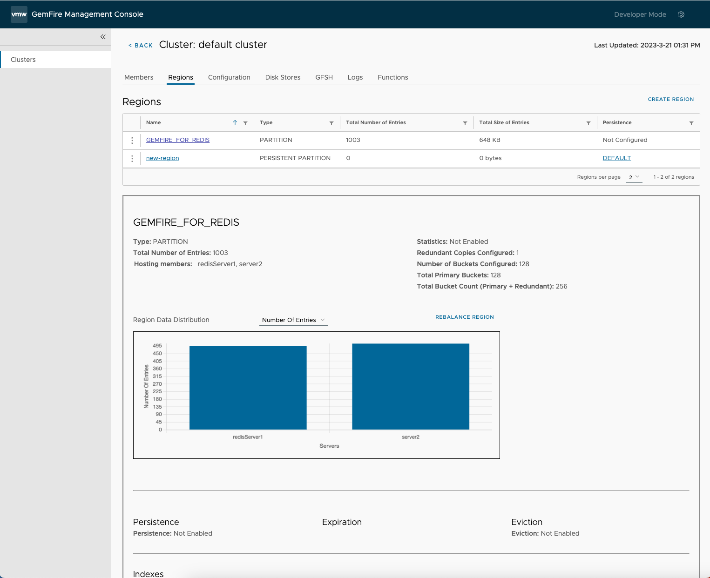

We are thrilled to announce the launch of the [VMware GemFire Management Console](https://support.broadcom.com/group/ecx/productdownloads?subfamily=VMware%20Tanzu%20GemFire%20Management%20Console), a new user interface (UI) for VMware GemFire, the in-memory distributed data store. The GemFire Management Console is an intuitive and easy-to-use tool that simplifies cluster management across all GemFire offerings, including VMware GemFire, VMware GemFire for TAS, and VMware GemFire for Kubernetes.

With the VMware GemFire Management Console, managing a fleet of GemFire clusters has never been easier. The new GemFire Management Console offers capabilities to simplify operations, diagnostics, and other management responsibilities. Whether users are creating and managing regions and disk stores, checking the general health of the clusters, reviewing log files, or deploying and executing functions, the VMware GemFire® Management Console™ makes managing GemFire clusters simpler. 

## View Clusters

One of the most exciting features of this new release is the ability to view multiple clusters in one UI. This is a significant improvement for GemFire administrators who manage multiple clusters by providing a centralized view of all the clusters, allowing administrators to quickly see the status and health of each cluster without having to switch between multiple windows. Having a unified view of multiple clusters enables administrators to compare the performance and usage of different clusters, which can be useful when deciding how to allocate resources or optimize configurations, making it easier to manage and monitor large-scale GemFire deployments.

The ability to quickly check the health and status of GemFire locators and servers running in a cluster is essential for ensuring that the system is running smoothly and is available to users. By providing real-time visibility into the state of the system, users can quickly identify any issues or bottlenecks and take corrective action before they impact the customer. This includes being able to see which members are up and running, how long they've been running, and how much computing power they are using. This information can be used to monitor the performance of the system, identify potential resource constraints, and optimize the allocation of resources to ensure that the system is running efficiently.  

 ## Regions

The GemFire Management Console includes the ability to create, view, and delete regions.  Regions are a key concept in GemFire that enables applications to store, retrieve, and update data using a key-value pair format. Regions offer features such as expiration, eviction, and partitioning, making them an essential building block in building scalable and high-performance distributed systems. This allows developers to achieve data locality, ensure data consistency, and boost application performance.  With the GemFire Management Console users can quickly see important information for all regions in a cluster in one place including the type of region, how many entries are in the region, and how much memory is being used by each region.   

## Disk Stores

With the new GemFire Management Console, users can now manage disk stores with ease. Disk stores are essential for applications that require high availability and fault tolerance. A disk store in GemFire is a mechanism to persist data from the cache to disk, ensuring that data is always available, even in the event of a server crash or network failure. Disk stores also provide a way to offload data from memory, enabling applications to scale beyond the limits of available memory.  

## Web Based GemFire Shell (GFSH) 

The web based GemFire Shell (GFSH) gives users access to the command line directly within the console, without the need to open and switch between multiple terminal windows. GFSH is a command-line interface tool that allows users to interact with and manage GemFire clusters. It provides a comprehensive set of commands that enable users to configure regions, query data, and monitor the health of the GemFire cluster. GFSH is a key tool for troubleshooting and diagnosing issues in the cluster, as it provides detailed information about the state of the system and enables users to perform debugging and profiling operations.

The GemFire Management Console includes the ability to save custom GFSH commands, allowing users to execute their most used commands with the click of a button. GFSH commands are saved for each cluster, so users have the freedom to customize commands for each cluster. 

## Cluster Log Files

The ability to view, filter, and search GemFire cluster log files directly within the GemFire Management Console helps users diagnose and resolve issues quickly. It eliminates the need to access log files from the command line or other external tools, providing a centralized location for users to view and analyze log files. With this feature, administrators can quickly identify and troubleshoot issues, such as exceptions and other errors that may occur within the cluster. Additionally, the ability to filter and search log files makes it easier to identify specific events or patterns that may be contributing to issues.  

## Functions

The GemFire Management Console brings the ability to deploy and execute functions to a GemFire cluster, allowing administrators to quickly and easily distribute functions across a cluster of nodes, without having to manually deploy them to each node individually. This saves time and effort, while also ensuring consistency and accuracy across the cluster. Additionally, the GemFire Management Console makes it easy to execute and manage functions, allowing users to quickly iterate and focus on a function's functionality.  

## Compatability
The GemFire Management Console allows users to view clusters across all GemFire deployment types including

- VMware GemFire: 9.15
- VMware GemFire: 10
- VMware GemFire for TAS: 1.14.5+
- VMware GemFire for Kubernetes: 2.1+  

---

With a streamlined user interface, powerful management capabilities, and advanced diagnostic tools, the VMware GemFire Management Console is the perfect tool for anyone looking to simplify their GemFire cluster management. Whether users are managing a single cluster or multiple clusters, the new Management Console makes it easier and more efficient to manage GemFire clusters.

Download the [VMware GemFire Management Console](https://support.broadcom.com/group/ecx/productdownloads?subfamily=VMware%20Tanzu%20GemFire%20Management%20Console) from the Broadcom Support Portal today and experience the power of streamlined GemFire cluster management. 

To learn more about the GemFire Management Console and GemFire:
  - GemFire Management Console:  [documentation](https://docs.vmware.com/en/VMware-GemFire-Management-Console/1.0/gfmc/index.html), [release notes](https://docs.vmware.com/en/VMware-GemFire-Management-Console/1.0/gfmc/release_notes.html), and [download](https://support.broadcom.com/group/ecx/productdownloads?subfamily=VMware%20Tanzu%20GemFire%20Management%20Console)
  - GemFire 10.0: [documentation](https://docs.vmware.com/en/VMware-GemFire/10.0/gf/about_gemfire.html), [release notes](https://docs.vmware.com/en/VMware-GemFire/10.0/gf/release_notes.html), and [download](https://support.broadcom.com/group/ecx/productfiles?subFamily=VMware%20Tanzu%20GemFire&displayGroup=VMware%20Tanzu%20GemFire&release=10.0.4&os=&servicePk=310412&language=EN)
  - Webinar: [GemFire 10 Features](https://gemfire.dev/videos/gemfire-10.0-beta-open/)
  - Video: [GemFire Management Console Demo](https://gemfire.dev/videos/gemfire-management-console-demo/) / [GemFire in two minutes](https://gemfire.dev/videos/gemfire-in-two-minutes/) / [The World of GemFire](https://gemfire.dev/videos/the-world-of-gemfire/) /  
