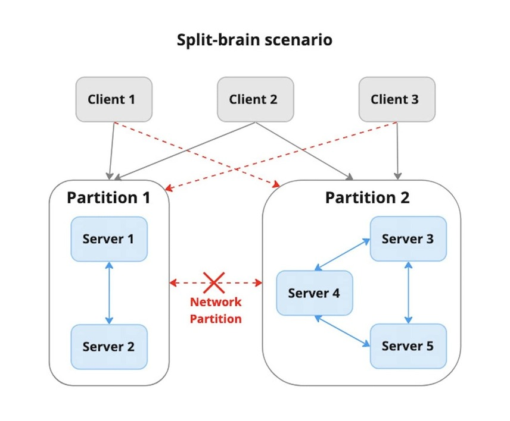
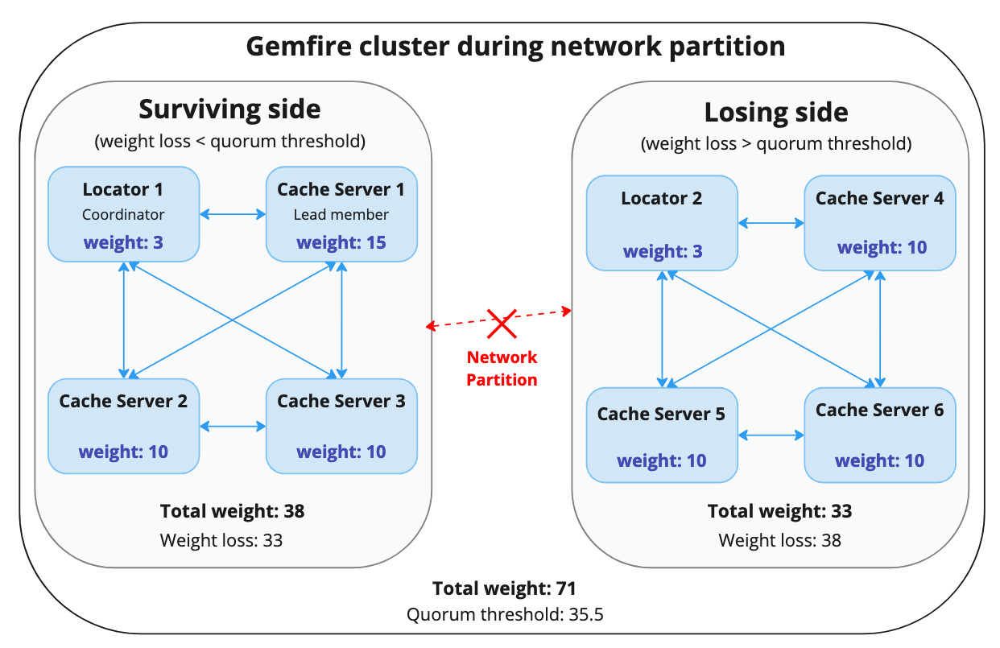

## Introduction

In today's fast-paced world, where we rely heavily on technology to keep our businesses running, downtime can be catastrophic. Network partitioning can be a major source of downtime for systems built on distributed architectures. When network partitioning occurs, it can lead to data loss, corrupted data, and even system crashes. This is where GemFire comes in, providing powerful tools to detect and recover from network failures. By detecting network partitions early and taking the necessary steps to recover, GemFire helps minimize the impact of downtime on systems that rely on it. In this blog post, we'll dive into how GemFire detects network partitions and recovers from them to maintain data consistency and avoid data loss during network failures.

## What is network partitioning and why should we care?

In general, network partitioning is a situation in a distributed system where a network failure or network latency causes the nodes in the system to be divided into multiple partitions, such that nodes in one partition cannot communicate with nodes in another partition. When this happens, each partition may start processing its own transactions independently, assuming it is the only valid partition in the system. This situation is known as a split-brain, and it can have severe consequences for the system's integrity and consistency.

In a split-brain scenario, multiple partitions may end up modifying the same data simultaneously, resulting in data corruption and lost updates. Furthermore, clients may communicate with servers from multiple subgroups or have access to one subgroup of servers, while another set of clients may only access another. Such inconsistencies can cause confusion and data conflicts, ultimately leading to the overall inefficiency and unreliability of the system.

*In this example, network partition divided the cluster into two partitions that can't communicate with each other. Each partition consists of servers that can contact other servers within the same partition. Client 1 can only communicate with the servers from Partition 1, while Client 3 can only communicate with the servers from Partition 2. Client 2 has access to all five servers.*

To prevent split-brain scenarios during a network partition, GemFire implements a mechanism that allows only one partition to exist and continue functioning. Other subgroups are promptly shut down to prevent any inconsistencies in data and processing.

## Network partition detection in GemFire

Before we dive into the specifics of the network partition detection mechanism, it is important to understand the fundamental concepts of the membership system in GemFire.

### Membership view

GemFire utilizes the concept of a membership view to maintain an up-to-date record of the members and their status within the distributed system. A membership view comprises an ordered list of all the current members, along with other metadata, such as the members that departed or crashed since the last view was produced. The membership view is maintained by a coordinator, a designated member, usually the oldest locator, responsible for managing the membership view and handling member join and leave events.

The coordinator generates a new membership view and distributes it to all members in the system in response to a membership change. Membership changes can occur for various reasons, such as when a new member requests to join the cluster or when an existing member leaves the cluster intentionally.

GemFire also has a failure detection mechanism that relies on heartbeat messages exchanged between members to detect unresponsive members. Each member observes messages from the peer to its right within the membership view. If a member suspects that its peer to the right has failed, it notifies all other members. The coordinator then attempts to connect to the suspected member. If the attempt is unsuccessful, the coordinator generates a new membership view with the suspected member removed from the list of members, adding it to the list of crashed members instead.

Another situation that can trigger a change in the membership view is when a member fails to respond to a new view distributed by the coordinator. After sending the new view to all members, the coordinator waits for an acknowledgment from each member. If a member doesn't acknowledge within the specified timeout period, the coordinator tries to connect to the member's failure-detection socket. If the coordinator fails to establish the connection, it considers the member dead and initiates the view distribution from the beginning, adding all unresponsive members to the list of crashed members for the next view.

### Quorum

Network partition detection in GemFire relies on the concept of quorum. A quorum is the minimum number of nodes that must be present and available for the system to continue functioning in the event of a network partition or other failure. Each member of the distributed system is assigned a specific weight based on its role and function within the system. By default, a locator is given a weight of 3, while each cache server is given a weight of 10. One of the cache servers, usually the oldest, is elected as a "lead member" and is given an additional weight of 5. The role of the lead member is to provide extra weight to increase its influence in the quorum calculation; it doesn't have any specific functionality. The default weights can be modified by defining the `gemfire.member-weight` system property upon startup.

### Quorum threshold and partition detection

When coordinator detects a membership change, it initiates the preparation of a new view. As one of the first steps of the view preparation, the coordinator verifies whether the new membership view still maintains a quorum of members. To detect network partition, GemFire ensures that any single change in membership cannot result in a loss of 50% or more of the total weight of the last membership view. More specifically, it ensures that the total weight of the crashed members in the new view is less than half of the weight of all members in the last view. It is important to note that the term "crashed members" refers to members deemed failed by the failure detector and does not include members that have gracefully departed the view, i.e., due to being scaled down. If the total weight of the crashed members exceeds this threshold, the coordinator informs the members of the new view about the loss of quorum due to possible network partition and disconnects with a `ForcedDisconnectException`. The members that received this message also disconnect with a `ForcedDisconnectException`.

In the event of a network partition, the "surviving side" that still has a quorum of members will continue to operate, while all the members of the partition that lost the quorum, known as the "losing side", will be disconnected. The surviving members will then work to recover and restore data consistency in the cluster.

*In this scenario, the partition on the left is the surviving side, as its total weight loss is less than half of the total weight of the cluster. The other subcluster lost the quorum, and its members will eventually disconnect.*

Without a quorum of members, the cluster cannot guarantee data consistency and may lead to data loss or corruption. Therefore, shutting down the partition that lost the quorum is a necessary step to ensure data integrity and prevent further issues in the system. Additionally, shutting down the losing side allows the surviving members to continue operating without interference from the lost members.

## Automatic Recovery

GemFire has an auto-reconnect mechanism that allows nodes to rejoin the distributed system automatically after a network partition or failure. Auto-reconnect ensures that the member can quickly rejoin the system and continue participating in data processing as soon as possible.

When a member is disconnected from the distributed system, either due to network failure or partitioning, it enters a "reconnecting" state and attempts to rejoin the cluster periodically by contacting a list of known locators. If the member is able to reconnect to a known locator, it rebuilds its view of the cluster from existing members. Otherwise, the reconnecting member will try to determine if it is a locator or is hosting an embedded locator process. If the member is a locator, it attempts to contact a quorum of members that were in the membership view before it disconnected. If the member is able to reach a quorum of members, it creates a new cluster.

By default, a member that lost its connection to the cluster will continuously attempt to reconnect until it receives an instruction to stop. For example, it may be necessary to stop the reconnection attempts when the member is experiencing persistent issues that impede successful reconnection or when it is no longer needed in the system. This can be done either manually by an administrator or programmatically through code. Automatic reconnection can be disabled entirely by setting `disable-auto-reconnect` property to "true."

## Conclusion

Network partitions are a common occurrence in distributed systems and can cause significant disruptions to the system's operations. GemFire provides robust features to detect and recover from network partitions. By implementing a quorum-based approach to membership management, GemFire ensures that the system can continue to operate even in the face of network failures. Additionally, GemFire provides features like auto-reconnect to ensure members can quickly rejoin the system and continue participating in data processing as soon as the network partition heals. By leveraging these features, users can minimize the impact of network partitions on their applications and ensure that their systems remain consistent and reliable even under adverse network conditions.