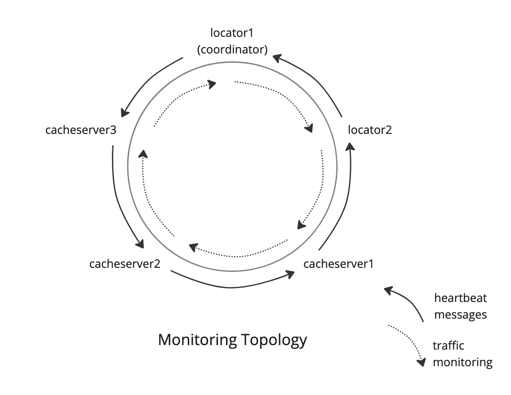



## Introduction

VMware GemFire achieves high availability through the familiar combination of redundancy and automatic failure detection coupled with timely repair of failed components.

Failure detection is the responsibility of the health monitor subsystem. The health monitor is always watching the processes in your distributed system. If a process stops communicating, the health monitor is ready to take action!

This post shines a light on failure detection, what it is, and why it's so critically important. We'll tour the health monitor and learn how it works and how it integrates with the rest of the system.

## A First Example

As a first step in understanding the importance of failure detection and the way it fits into the architecture, let's look at the role of failure detection in what is perhaps the defining component of VMware GemFire, the partitioned region.

When a partitioned region is configured for high availability, each bucket has a primary copy, and one or more secondary copies. Each of these copies (primary and secondary ones) is hosted on a different cache server. When the cache server hosting the primary copy fails, a secondary copy can be reclassified from secondary to primary copy. Processing can return to normal quickly, and the failed cache server can be repaired or replaced later in order to regain the original redundancy level.

But what does it mean for a cache server to fail? Well, a cache server is one of many GemFire processes communicating via the network. If some GemFire process is unable to communicate with a cache server, then that process can raise suspicion against that cache server. If other processes confirm the suspicion then the noncommunicative cache server is deemed failed and is shut down. The health monitor is the subsystem responsible for carrying out this suspect processing.

The health monitor is part of the membership system. The membership system's primary responsibility is to keep track of the cluster of cache servers and locators comprising the distributed system. In membership system parlance, those cache servers and locators are called "members". The membership system provides mechanisms for forming a new distributed system and for adding and removing members. The membership system ensures that each member has an (eventually) consistent view of the identities and network coordinates of all the members in the distributed system.

When the health monitor decides that a member has failed, it lets the membership system know, and that member is removed from the view. That removal triggers the partitioned region bucket management logic to redesignate some surviving secondary bucket as the new primary one. After that, application-level updates to the bucket can resume.

Without failure detection, an update to a bucket whose primary copy was stored on a crashed cache server would simply hang or time out. It is failure detection that drives the redesignation of a secondary copy to the primary copy, allowing the update to be serviced eventually. 

Now that we can appreciate the importance of failure detection, let's take a look at how it works.

## Suspicion Arises

As we said in the introduction, the health monitor acts on suspicion reports about members. This sometimes results in the removal of noncommunicative members from the cluster.

As an example where suspicion might be raised, consider a `put(key,value)` operation arriving at a primary bucket. To ensure availability of the new value, the partitioned region logic will update the pertinent entry on the primary copy and on each secondary copy. If a cache server hosting a secondary copy cannot be reached, then suspicion is raised. The partitioned region logic can continue along updating other secondary buckets. Concurrently, the health monitor will carry out an investigation of the suspicious member.

If the health monitor eventually decides that the suspicious member has failed, that member will be removed from the cluster. The sooner this happens, the better. If you imagine lots of `put(key,value)` and `get(key)` requests arriving at many cache servers in a large cluster simultaneously and continually, the quicker the health monitor is at noticing a failed member, the sooner region logic can begin to compensate for the failure and the less disruption will be encountered by the clients.

In the failed replication example just sketched, the health monitor was alerted by the server-side processing of a client request. When the member hosting the primary copy was unable to connect to one of the members hosting a secondary copy, the health monitor was engaged. If this was the only way to notice a failed member then clusters with bursty workloads would be susceptiable to long interruptions. A member could fail during a lull in client requests but the membership system wouldn't notice it. When the lull ended and client requests resumed, those clients would be delayed by failure detection and escalation and ultimately compensation such as primary copy movement.

Two parts of the health monitor address this vulnerability to lulls in application workload. First, each member has its network traffic monitored by one other member. If a long gap in communication is detected, then the health monitor is notified of the suspicious member. Second, to ensure that there is a continual flow of network traffic from each monitored member to its monitoring member, even during lulls in application-level requests, "heartbeat" messages are sent periodically.

To summarize, there are two contexts in which failed members are initially suspected. Failed members are suspected when an application-level operation gives rise to a failed communication attempt. In this case suspicion can arise incidentally from any network communication between members. Since there can be lulls in that incidental communication, the health monitor generates periodic heartbeat messages between members. Each member's network communication is monitored by one other member. Long gaps in communication result in suspicion being raised.

Let's take a deeper look at this traffic monitoring and heartbeat generation.

## Proactive Measures

The membership system maintains a view of all the members in the distributed system, their identities and network coordinates. This is what the view looks like in a system log file: 

    591:[info 2023/04/04 13:54:06.859 PDT locator1 <Geode Membership View Creator> tid=0x33]
    sending new view View[some-host(locator1:24849:locator)<ec><v0>:43531|1] members:
    [some-host(locator1:24849:locator)<ec><v0>:43531,
    some-host(locator2:24865)<v1>:57034{lead},
    some-host(cacheserver1:24873)<v1>:51496, some-host(cacheserver2:24880)<v1>:56394, some-host(cacheserver3:24891)<v1>:42993]

For readability, I have added some line breaks to what would be a single log line. See [Failure Detection and Membership Views](https://docs.vmware.com/en/VMware-GemFire/10.0/gf/managing-network_partitioning-failure_detection.html) for a detailed description of the view log format. For our purposes it is enough to note that this view has these five members, in this order:

    locator1, locator2, cacheserver1, cacheserver2, cacheserver3

The member listed first (in this case, `locator1`) is always the membership coordinator. We'll have more to say about the coordinator later.

As we said earlier, each member's communication is monitored by one other member. You can think of the monitoring relationships forming a ring of members. It so happens that each member is monitored by the member to its left in the view. The left-most member is monitored by the right-most one, thereby completing the ring. In this example `locator1` (the coordinator) monitors communication from `locator2`. If `locator1` has no communication from `locator2` for a long time, then `locator1` will raise suspicion against `locator2`.

Heartbeat messages are generated in the opposite direction. Each member generates heartbeat messages to the member to its left. `locator2` will periodically generate heartbeat messages to `locator1`. Under normal conditions, this will keep the traffic monitor in `locator1` satisfied that `locator2` is functioning properly, even if there are no application-level (put/get) requests being processed by the cluster.

## Escalations and Outcomes

Here's a swimlane diagram showing three members involved in an escalation:

M is the member monitoring communication from F, the member that has ostensibly failed. C is the coordinator. In this picture we see suspicion raised by a traffic monitor.

Whether suspicion (of a member) arises because of some failed communication attempt with that member, or arises because of a traffic monitor noticing a lull in communication from that member, after the health monitor receives a suspicion notification, the process is the same.

In this case, in the first (top) segment on the M line we see that F sent its final communication to M. Some time (Tm/2) later, having heard no further communication, M raises suspicion. That is to say, the traffic monitor running on M raises suspicion.

The first thing that happens after suspicion is raised is that the health monitor running on M sends a heartbeat-request message to F. If F is working properly, this will cause it to immediately send a heartbeat back to M. But if F doesn't do that in time (Tm) then suspicion processing will move to its next phase.

After receiving no communication from F after the "heartbeat-request" message, M sends a "suspect" message to the coordinator, C. Upon receipt of that message, the coordinator does two things. It sends its own heartbeat-request message to F, and it makes a "final check" request on F. The final check request is made over a new connection to F on F's dedicated failure detection port. If the new connection attempt fails, or if no response is received to the request on that connection, and no other network communication is received by C from F in time (Tm) then coordinator C deems F failed.

When the coordinator C deems member F failed, F is removed from the view. A "remove-member" message is sent to all remaining members and a new view, a view no longer containing member F, is distributed to all the remaining members.

If member F is able to receive any of this communication it will enter its forced-disconnect processing and shut itself down. If member F doesn't receive the new view and it doesn't receive the remove-member message it may keep running. But because the other members of the view no longer recognize F as a member, F will not be able to participate in any further cluster processing.

A number of decision points are visible in the previous diagram. At each point a health monitor (running on the monitoring member M, or on the coordinator C) will stop the escalation process if recent communication has been received from the suspect member. Notice too, that for suspicion to progress all the way to removal, two members, the monitoring member M, and the coordinator C, must have both lost contact with the failed member F. If M loses contact and escalates to C, but C has contact, then F will survive as a member of the cluster.

## Timing and Tuning
As noted earlier, the health monitor can be notified of suspicion on a member immedately if a communication attempt to that member fails. The same happens when a connection to a member is closed unexpectedly.

The traffic monitoring component of the health monitor raises suspicion when a member hasn't been heard from recently. The primary configuration parameter governing the speed at which suspicion escalates to forced-disconnect is `member-timeout` denoted Tm the previous discussion. It defaults to 5 seconds (5000 milliseconds). `member-timeout` governs:
* quiet period before heartbeat-request message is sent to monitored member by monitoring one (Tm/2)
* subsequent quiet period before monitoring member sends suspect message to coordinator (Tm)
* quiet period coordinator waits after sending heartbeat-request message and performs final check, before removing the member from the view (Tm)

A pair of configuration parameters govern the timing of suspicion in a scenario we have not yet discussed: request-response messaging. In request-response messaging a member sends a request and expects a response later. If no response is received then a warning is logged. `ack-wait-threshold` governs the waiting time. It defaults to 15 seconds.

After the `ack-wait-threshold` has elapsed, if no response has been received, and if `ack-severe-alert-threshold` has a non-default (non-zero) value, then if no response is received for another `ack-severe-alert-threshold` seconds, then suspicion will be raised with the health monitor. That will result in the same sequence of processing we've seen in all other cases where suspicon is raised, starting with the health monitor sending a heartbeat-request message to the member of interest.

## Recovery from Failure

At the beginning of this article we noted that timely repair of failed components was integral to high availability. What does it mean to repair a failed member? The answer depends on the environment GemFire is running in and it also depends on the nature of the fault that led to the health monitor deciding the member had "crashed".

If the health monitor decides a member has crashed it may not have actually crashed. The failure to communicate may be due to networking problems. A member in this situation will execute a forced-disconnect and then will go into a reconnecting state. If the network problems are resolved, this member will rejoin the cluster.

If the member really crashed, say, due to a hardware failure then recovery depends on the platform. When using GemFire for Kubernetes, the GemFire operator will automatically spin up a new pod to replace the failed one. That pod will host a cache server that will join the cluster and will take over the responsibilities of the failed one. When running GemFire without the assistance of the GemFire operator, then it is up to an administrator to use gfsh to replace failed members.

## Summary

We've seen how failure detection contributes to high availability. Two scenarios were sketched. In the first, loss of a cache server hosting a primary copy of a partitioned region resulted in failure detection and eventual redesignation of a secondary copy as a new primary copy, allowing service to continue. In the second we saw how failure detection arose during maintenance of redundant copies of a partitioned region.

Failure detection starts with suspicion being raised to the health monitor. Suspicion can arise in a number of circumstances:
* failure to connect to a member
* failure to send to a member
* unexpected disconnection of a connected member
* failure to receive an expected acknowledgement in time (if `ack-severe-alert-threshold` is set)
* failure (at a monitoring member) to receive network communication (from a monitored member) for a long time

We saw the monitoring topology, a ring, and learned how heartbeat messages are used to detect failures during lulls in application workload.

Once suspicion has been raised, regardless of the source of suspicion, the escalation process is the same. The member where suspicion is raised issues a heartbeat-request message to the suspect member. If there is still no communication, suspicion is escalated to the coordinator, which in turn probes the suspect member. If those probes go unanswered then the member is deemed crashed and is removed from the view.

To complete the picture we saw that "crashed" members can automatically rejoin the cluster after a network problem is resolved. And we saw that certain kinds of failure can be automatically recovered from in a Kubernetes installation.
