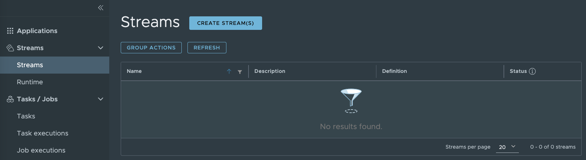
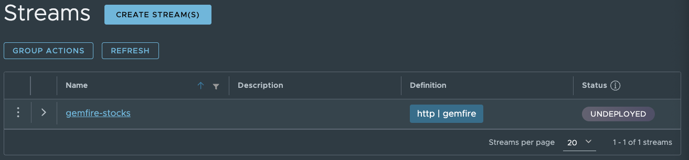
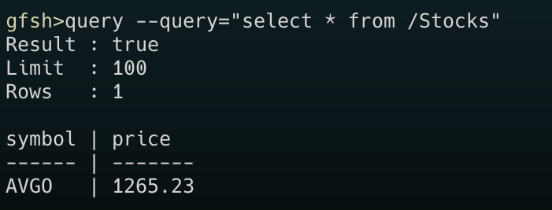
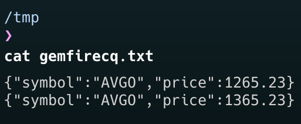

The release of [Spring Cloud Data Flow for GemFire](https://github.com/gemfire/spring-cloud-data-flow-for-vmware-gemfire) and [Spring Integration for GemFire](https://github.com/gemfire/spring-integration-for-vmware-gemfire) marks another milestone for [VMware GemFire's](https://tanzu.vmware.com/gemfire) integration with the [Spring](https://spring.io/) ecosystem. Joining the existing projects, [Spring Data for GemFire](https://github.com/gemfire/spring-data-for-vmware-gemfire), [Spring Session for GemFire](https://github.com/gemfire/spring-session-for-vmware-gemfire), and [Spring Boot for GemFire](https://github.com/gemfire/spring-boot-for-vmware-gemfire), to provide seamless integration of GemFire with Spring.

In this blog a quick overview of [Spring Cloud DataFlow](https://spring.io/projects/spring-cloud-dataflow) (SCDF) and [Spring Cloud Stream Applications](https://spring.io/projects/spring-cloud-stream-applications) are provided, followed by simple examples for Spring Cloud Data Flow for GemFire and how they can be used. For further information about Spring Cloud Data Flow or Spring Cloud Stream Applications, follow the links provided.

## What is Spring Cloud DataFlow?
Spring Cloud Data Flow(SCDF) is a micro-service-based stream and batch processing system. Some of the use cases it supports include extract, transform, and load (ETL), import-export, event streaming and predictive analytics.

In event streaming there are 3 main components:
* Suppliers - supplies data
* Processors - processes input data from one form and outputs processed data.
* Consumers - consumes data

Event streams are also known as pipelines within SCDF. In the simplest example, streams generally consist of a supplier, zero or more processors and a consumer. There are many different stream patterns, like [fan-in or fan-out](https://dataflow.spring.io/docs/feature-guides/streams/fanin-fanout/), which are explained better in the SCDF [documentation](https://dataflow.spring.io/docs/feature-guides/streams/).

Using SCDF vernacular, “suppliers” are “sources” and “consumers” are “sinks”. Source, processors and sinks are connected using connectors, which are known as “Binders”. Binders are “point-to-point” meaning  SCDF provides 2 binders out of the box, [Apache Kafka](https://kafka.apache.org/) and [RabbitMQ](https://www.rabbitmq.com/), other binders can be found [here](https://dataflow.spring.io/docs/concepts/streams/). 

## Spring Cloud Data Flow for VMware GemFire

Spring Cloud Data Flow for GemFire (SCDFGF) is an implementation that is specifically targeted at the event streaming use case, within the SCDF system. SCDFGF provides implementations for both a “source” and “sink”, for GemFire. Leveraging GemFire’s [Continuous Queries](https://docs.vmware.com/en/VMware-GemFire/10.1/gf/developing-continuous_querying-chapter_overview.html) and [Subscription](https://docs.vmware.com/en/VMware-GemFire/10.1/gf/developing-events-tune_client_server_event_messaging.html) for the “source” implementation. SCDFGF also provides bindings for both RabbitMQ and Kafka.

Spring Cloud Data Flow for GemFire has released four artifacts compatible with SCDF versions 2.10.x and 2.11.x:

* GemFire Source Rabbit : 1.0.0
* GemFire Source Kafka : 1.0.0
* GemFire Sink Rabbit : 1.0.0
* GemFire Sink Kafka : 1.0.0

These artifacts are available in both the Broadcom Maven Repository and Docker Hub. Details on how to access and install these artifacts can be found in the [Spring Cloud Data Flow for GemFire](https://gemfire.dev/documentation/spring/spring_cloud_data_flow_for_gemfire.pdf) documentation.

The following examples showcase both the GemFire Source and GemFire Sink applications for Spring Cloud Data Flow.

---

## Prerequisites 
In order to run the examples, a Spring Cloud Data Flow (SCDF) environment and running GemFire cluster are required.

### Setup Spring Cloud Data Flow Server
- To install an SCDF environment follow the “[Installation Guide](https://dataflow.spring.io/docs/installation/)” for SCDF. For this example we used the [Manual Installation](https://dataflow.spring.io/docs/installation/local/manual/). 

- For manual installation, RabbitMQ is selected as the messaging connector (as per the instructions [here](https://dataflow.spring.io/docs/installation/local/manual/#install-messaging-middleware)) and is launched using Docker. The manual installation utilizes a RabbitMQ image based on **version 3.7**, which aligns with the examples provided. It's important to note that RabbitMQ must be running for these examples to function correctly. If you're using a different RabbitMQ version or have additional authentication requirements, ensure to add the necessary Spring properties for configuration.

- Once you have started the [server](https://dataflow.spring.io/docs/installation/local/manual/#dataflow), [skipper](https://dataflow.spring.io/docs/installation/local/manual/#skipper) and RabbitMQ, open a browser and navigate to the SCDF Dashboard which runs at [http://localhost:9393/dashboard](http://localhost:9393/dashboard) by default.

- Click on "Applications" in the left menu. Then click "Add Application(s)". 
- In the **Import application starters from dataflow.spring.io** select the starters for the messaging connector being used. For this example we used the **Stream application starters for RabbitMQ/Maven**.  This will then install a set of out-of-the-box applications, some of which are needed for the following examples.

### Setup GemFire Environment
For these examples a GemFire environment is required.

- Download the latest GemFire from [Broadcom Support Portal](https://support.broadcom.com/group/ecx/productfiles?subFamily=VMware%20Tanzu%20GemFire&displayGroup=VMware%20Tanzu%20GemFire&release=10.1.1&os=&servicePk=310413&language=EN)
- Extract the GemFire archive to known location
- Navigate to the installation folder for GemFire
- Run Gfsh in the bin directory, by either running `./gfsh.sh` or `gfsh.bat` (depending on Windows or Linux/MacOS)
- Start a Locator by running the following gfsh command 
   ```
   start locator --name=locator1
  ```
- Note the locator's **host / IP address and the port** of the locator. These will be used when creating the Streams. 

   For example, in the following output the locator's host is `192.168.68.51` and the port is `10330`
   ```
   Starting a GemFire Locator in /Users/dev/gemfire/site0/locator...
   ..............
   Locator in /Users/dev/gemfire/site0/locator on 192.168.68.51[10330] as site0_locator is currently online.
   Process ID: 7462
   Uptime: 11 seconds
   Geode Version: 10.1.0
   Java Version: 11.0.22
   Log File: /Users/dev/gemfire/site0/locator/site0_locator.log
   ```
  
- Start a Server by running the following gfsh command
   ```
   start server --name=server1
   ```

- Create a GemFire data region, “Stocks” using the gfsh command:
   ```
    create region --name=Stocks --type=REPLICATE
  ```
---

## Examples


Below are two examples:
1. GemFire as a **Sink**. Receiving data from an HTTP REST endpoint and writing to GemFire. A pipeline will be set up with an “http” source, taking a stock quote and writing the quote into a GemFire region.
2. GemFire as a **Source**. Receiving data from GemFire and writing it to a file. A pipeline will be set up monitoring a “Stocks” region, using a GemFire CQ. Any stock orders over 1000 will be written to a file.

>These example **requires** the [Prerequisite](#prerequisites) section to have been completed.

## GemFire Sink

### Add the GemFire Sink RabbitMQ Application
There are two methods to deploy the artifacts into the Spring Cloud Dataflow Server: using the images from Docker Hub or download the artifacts from the Broadcom Maven repository.

Choose <u>one</u> of the following options:

1. **Docker Hub Images**

   1. Log in to your Spring Cloud Dataflow Server.
   2. Add the Application using the **Add Application** button.
   3. Select the first option **Register one or more applications** and enter the following information:
   
      - **Name:** `gemfire` or `gemfire-sink-rabbit`.
      - **Type:** `sink`.
      - **Spring Boot version:**  `Spring Boot 2.x`.
      - **URI:**  `docker://docker.io/gemfire/gemfire-sink-rabbit:1.0.0`

   5. Click **Import Application** to import the GemFire Sink for Rabbit Stream Application.

OR

2. **Broadcom Maven Repository Artifacts**

   1. In a browser, navigate to the [Broadcom Support Portal](https://support.broadcom.com/group/ecx/productdownloads?subfamily=VMware%20Tanzu%20GemFire).

   2. Login (or register if you have not already).

   3. Click Show All Releases and find "Click Green Token For Repository Access" (don't click the blue text; click the green icon to the right of it).

   4. Once you have a Broadcom Maven Repository account created, you can now download the GemFire Sink Rabbit artifact (replace `{broadcomMavenRepoEmail}` with your Broadcom maven repo email):

      ```
      wget https://packages.broadcom.com/artifactory/gemfire/com/vmware/gemfire/spring/cloud/stream/app/gemfire-sink-rabbit/1.0.0/gemfire-sink-rabbit-1.0.0.jar --user {broadcomMavenRepoEmail} --ask-password
      ```
      
   5. Log in to your Spring Cloud Dataflow Server.
   6. Add the Application using the **Add Application** button.
   7. Select the third option, **Import application coordinates from properties file**.
   8. Add the `sink` properties, replacing `{artifactFileName}` with the location of the downloaded artifacts from step 2. You can change the application name (`gemfire`) as needed.

      ```
      sink.gemfire=file://{artifactFileName}
      ```
   9. Click **Import Application** to import the GemFire Sink for Rabbit Stream Application. It may a take a minute for this application to appear in the SCDF Applications list.
      
   See the [Spring Cloud Data Flow for GemFire documentation](https://gemfire.dev/documentation/spring/spring_cloud_data_flow_for_gemfire.pdf) for additional detailed installation instructions or to install the GemFire Sink application for Kafka.

### Create the GemFire Sink Stream

1. In the terminal running the GemFire shell (GFSH), confirm that you have the required region, "Stocks",  using the gfsh command:
`list regions`. You should see a region named `Stocks` listed. If not, confirm that you have a GemFire cluster running using the steps in the [Prerequisite](#prerequisites) section.

2. In the [Spring Cloud Data Flow dashboard](http://localhost:9393/dashboard), create a SCDF stream that will take an HTTP request and put it into the GemFire data Region “Stocks”.

    In the toolbar on the left, select “Streams”. You should now be able to create a new stream.

       
    

3. Click on “Create Stream(s)” and add the following line to the top text box.
   ```
   http --port=9098 | gemfire --region-name=Stocks --key-expression=payload.getField('symbol') --json=true  --gemfire.pool.host-addresses=gemfire_locator_host:gemfire_locator_port --spring.rabbitmq.host=rabbitmq_host
   ```
   - You can change the `http --port=9098` from `9098` to another port as needed.
   - If you've customized the GemFire Sink application name, ensure that you update the `gemfire` property accordingly.
   - For the `--gemfire.pool.host-addresses=` parameter, enter the host/IP address and port of the GemFire cluster's locator from the GemFire cluster setup. Note that on some machines, localhost may not resolve correctly, so it's essential to use the IP address of the locator instead.
   - For the `--spring.rabbitmq.host=` parameter, enter the host/IP address of your currently running RabbitMQ instance (started during the SCDF installation process).
  
4. Click on the “Create Stream(s)” button. A popup will appear, prompting you to enter a name for the stream. Type `gemfire-stocks` and click "Create the Stream(s)". Once created, you should see the newly created stream named `gemfire-stocks` on the “Streams” screen. Note that the *Status* will be **Undeployed**.

   

   
5. Now the stream needs to be deployed. This can be done by clicking the stream name. Then click the button `Deploy Stream`. This will take you to another screen that allows you to confirm and/or configure the SCDF application properties as needed. Click the `Deploy the Stream` button at the bottom.

   It may take a moment for the stream to deploy successfully. To confirm their deployment:
   
      - Click on the stream name (`gemfire-stocks`).
      - In the "Runtime" section, you should see two items - http and gemfire. Click the "View Log" button for the gemfire item.
      - Upon successful deployment, you should see a message similar to: "Started GemfireSinkRabbitApplication in 14.825 seconds (JVM running for 16.838)."
      > Please note that the SCDF Dashboard UI may not indicate the stream as 'successfully' deployed, even if though it is functioning correctly.

### Run the GemFire Sink Example

1. Once successfully deployed, open a terminal and the run the following curl command
   ```
   curl -d '{"symbol":"AVGO","price":1265.23}' -H "Content-Type: application/json" -X POST http://localhost:9098
   ``` 

   This will post a json document to the stream deployed http source, hosted on port 9098.

2. To see if the result was correctly processed, use the following gfsh command to see if the data was put into the GemFire data region “Stocks” 

   ```
   query --query="select * from /Stocks"
   ```
   
   


---

## GemFire Source

> This example requires the [Prerequisites](#prerequisites) and [GemFire Sink](#gemfire-sink) example to have been completed.

### Add the GemFire Source RabbitMQ Application

There are two methods to deploy the artifacts into the Spring Cloud Dataflow Server: using the images from Docker Hub or download the artifacts from the Broadcom Maven repository.

Choose <u>one</u> of the following options:

1. **Docker Hub Images**

   1. Log in to your Spring Cloud Dataflow Server.
   2. Add the Application using the **Add Application** button.
   3. Select the first option **Register one or more applications** and enter the following information:

      - **Name:** `gemfire` or `gemfire-source-rabbit`.
      - **Type:** `source`.
      - **Spring Boot version:**  `Spring Boot 2.x`.
      - **URI:**  `docker://docker.io/gemfire/gemfire-source-rabbit:1.0.0`

   5. Click **Import Application** to import the GemFire Source for Rabbit Stream Application.

OR

2. **Broadcom Maven Repository Artifacts**

   1. In a browser, navigate to the [Broadcom Support Portal](https://support.broadcom.com/group/ecx/productdownloads?subfamily=VMware%20Tanzu%20GemFire).

   2. Login (or register if you have not already).

   3. Click Show All Releases and find "Click Green Token For Repository Access" (don't click the blue text; click the green icon to the right of it).

   4. Once you have a Broadcom Maven Repository account created, you can now download the GemFire Source Rabbit artifact (replace `{broadcomMavenRepoEmail}` with your Broadcom maven repo email):

      ```
      wget https://packages.broadcom.com/artifactory/gemfire/com/vmware/gemfire/spring/cloud/stream/app/gemfire-source-rabbit/1.0.0/gemfire-source-rabbit-1.0.0.jar --user {broadcomMavenRepoEmail} --ask-password
      ```   

   5. Log in to your Spring Cloud Dataflow Server.
   6. Add the Application using the **Add Application** button.
   7. Select the third option, **Import application coordinates from properties file**.
   8. Add the `source` properties, replacing `{artifactFileName}` with the location of the downloaded artifacts from step 2. You can change the application name (`gemfire`) as needed.

      ```
      source.gemfire=file://{artifactFileName}
      ```
   9. Click **Import Application** to import the GemFire Source for Rabbit Stream Application. It may a take a minute for this application to appear in the SCDF Applications list.

   See the [Spring Cloud Data Flow for GemFire documentation](https://gemfire.dev/documentation/spring/spring_cloud_data_flow_for_gemfire.pdf) for additional detailed installation instructions or to install the GemFire Source application for Kafka.

### Create the GemFire Sink Stream
1. In the SCDF web dashboard, navigate to the “Streams” screen.

2. On the toolbar on the left, select “Streams”. One should now be able to create a new stream.

   
 
3. Click on “Create Stream(s)”. On the “Create Stream(s)” screen, add the following line to the top text box.
   ```
   gemfire --region-name=Stocks --query='SELECT * from /Stocks s where s.price > 999' --cq-event-expression=getNewValue().toString() --subscription-enabled=true --connect-type=locator --json=true  --gemfire.pool.host-addresses=gemfire_locator_host:gemfire_locator_port  --spring.rabbitmq.host=rabbitmq_host | file --directory=/tmp --name=gemfirecq.txt
   ```
   - For the `--gemfire.pool.host-addresses=` parameter, enter the host/IP address and port of the GemFire cluster's locator from the GemFire cluster setup. Note that on some machines, localhost may not resolve correctly, so it's essential to use the IP address of the locator instead.
   - For the `--spring.rabbitmq.host=` parameter, enter the host/IP address of your currently running RabbitMQ instance (started during the SCDF installation process).


4. Click on the “Create Stream(s)” button. A popup will appear, prompting you to enter a name for the stream. Type `gemfire-orders` and click "Create the Stream(s)". Once created, you should see the newly created stream named `gemfire-orders` on the “Streams” screen. Note that the *Status* will be **Undeployed**.

5. Now the stream needs to be deployed. This can be done by clicking the stream name. Then click the button `Deploy Stream`. This will take you to another screen that allows you to confirm and/or configure the SCDF application properties as needed. Click the `Deploy the Stream` button at the bottom.

   It may take a moment for the stream to deploy successfully. To confirm their deployment:

   - Click on the stream name (`gemfire-orders`).
   - In the "Runtime" section, you should see two items - file and gemfire. Click the "View Log" button for the gemfire item.
   - Upon successful deployment, you should see a message similar to: "Started GemfireSourceRabbitApplication in 14.941 seconds (JVM running for 16.511)"
   > Please note that the SCDF Dashboard UI may not indicate the stream as 'successfully' deployed, even if though it is functioning correctly.

This will now create a stream which creates a GemFire CQ against the “Stocks” region. The CQ will trigger when the value for a stock exceeds a price of 1000. That stock will then be written to a file, `gemfire-cq.txt`, in the `/tmp` directory.

### Run GemFire Source Example
1. Run the following command which should write an entry to the file.
   ```
   curl -d '{"symbol":"AVGO","price":1265.23}' -H "Content-Type: application/json" -X POST http://localhost:9098
   ```
2. Check the file by running the following command in the terminal
   ```
   cat /tmp/gemfirecq.txt
   ``` 
   You should see the following entry.   

      

3. Run the following command which should **NOT** write an entry to the file.
   ```
   `curl -d '{"symbol":"AVGO","price":265.23}' -H "Content-Type: application/json" -X POST http://localhost:9098
   ```
4. Confirm that the entry was NOT written to the file by running the 
   ```
   cat /tmp/gemfirecq.txt
   ```
5. Now, run the following command again, with a different price, which should write an entry to the file. 
   ```
   curl -d '{"symbol":"AVGO","price":1365.23}' -H "Content-Type: application/json" -X POST http://localhost:9098
   ```
6. Check the file again and you should see two entries:
   ```
   cat /tmp/gemfirecq.txt
   ``` 

   


## Conclusion
Through these Spring Cloud Data Flow for GemFire (SCDFGF) examples, we showcased scenarios such as utilizing GemFire to receive data from HTTP REST endpoints and writing to GemFire, as well as monitoring GemFire data for specific conditions and writing the results to a file. These practical demonstrations underscore the versatility and applicability of GemFire within the Spring ecosystem for diverse business needs.

This seamless integration of GemFire within Spring Cloud Data Flow can empower a multitude of real-world applications across various industries: GemFire can facilitate high-frequency trading platforms, accelerate medical data analysis for faster diagnoses, optimize network performance and customer experience, and even enable real-time sports analytic insights for coaches and analysts. These examples underscore GemFire's versatility in driving efficiency and innovation across diverse business sectors within the Spring ecosystem.
