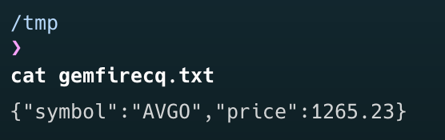

The release of [Spring Cloud Data Flow for GemFire](https://github.com/gemfire/spring-cloud-data-flow-for-vmware-gemfire) and [Spring Integration for GemFire](https://github.com/gemfire/spring-integration-for-vmware-gemfire) marks another milestone for [VMware GemFire's](https://tanzu.vmware.com/gemfire) integration with the [Spring](https://spring.io/) ecosystem. Joining the existing projects, [Spring Data for GemFire](https://github.com/gemfire/spring-data-for-vmware-gemfire), [Spring Session for GemFire](https://github.com/gemfire/spring-session-for-vmware-gemfire), and [Spring Boot for GemFire](https://github.com/gemfire/spring-boot-for-vmware-gemfire), to provide seamless integration of GemFire with Spring.

In this blog a quick overview of [Spring Cloud DataFlow](https://spring.io/projects/spring-cloud-dataflow) (SCDF) and [Spring Cloud Stream Applications](https://spring.io/projects/spring-cloud-stream-applications) are provided, followed by simple examples for Spring Cloud Data Flow for GemFire and how they can be used. For further information about Spring Cloud Data Flow or Spring Cloud Stream Applications, follow the links provided.

## What is Spring Cloud DataFlow?
Spring Cloud Data Flow(SCDF) is a micro-service-based stream and batch processing system. Some of the use cases it supports include extract, transform, and load (ETL), import-export, event streaming and predictive analytics.

In event streaming there are 3 main components:
* Suppliers - supplies data
* Processors - processes input data from one form and outputs processed data.
* Consumers - consumes data

Event streams are also known as pipelines within SCDF. In the simplest example, streams generally consist of a supplier, zero or more processors and a consumer. There are many different stream patterns, like [fan-in or fan-out](https://dataflow.spring.io/docs/feature-guides/streams/fanin-fanout/), which are explained better in the SCDF [documentation](https://dataflow.spring.io/docs/feature-guides/streams/).

Using SCDF vernacular, “suppliers” are “sources” and “consumers” are “sinks”. Source, processors and sinks are connected using connectors, which are known as “Binders”. Binders are “point-to-point” meaning  SCDF provides 2 binders out of the box, [Apache Kafka](https://kafka.apache.org/) and [RabbitMQ](https://www.rabbitmq.com/), other binders can be found [here](https://dataflow.spring.io/docs/concepts/streams/). 

## Spring Cloud Data Flow for VMware GemFire

Spring Cloud Data Flow for GemFire (SCDFGF) is an implementation that is specifically targeted at the event streaming use case, within the SCDF system. SCDFGF provides implementations for both a “source” and “sink”, for GemFire. Leveraging GemFire’s [Continuous Queries](https://docs.vmware.com/en/VMware-GemFire/10.1/gf/developing-continuous_querying-chapter_overview.html) and [Subscription](https://docs.vmware.com/en/VMware-GemFire/10.1/gf/developing-events-tune_client_server_event_messaging.htmlloping-events-tune_client_server_event_messaging.html) for the “source” implementation. SCDFGF also provides bindings for both RabbitMQ and Kafka.

Spring Cloud Data Flow for GemFire has released four artifacts compatible with SCDF versions 2.10.x and 2.11.x:

* GemFire Source Rabbit : 1.0.0
* GemFire Source Kafka : 1.0.0
* GemFire Sink Rabbit : 1.0.0
* GemFire Sink Kafka : 1.0.0

These artifacts are available in both the GemFire Commercial Maven Repository and Docker Hub. Details on how to access and install these artifacts can be found in the [Spring Cloud Data Flow for GemFire](https://gemfire.dev/documentation/spring/spring_cloud_data_flow_for_gemfire.pdf) documentation.

The following examples showcase both the GemFire Source and GemFire Sink applications for Spring Cloud Data Flow.

## Prerequisite 
In order to run the examples, a Spring Cloud Data Flow (SCDF) environment and GemFire cluster are required.

### Setup 
To install an SCDF environment follow the “[Installation Guide](https://dataflow.spring.io/docs/installation/)” for SCDF. For this example RabbitMQ will be used as the messaging connector (as per the [instructions](https://dataflow.spring.io/docs/installation/local/manual/#install-messaging-middleware)).

Once you have started the [server](https://dataflow.spring.io/docs/installation/local/manual/#dataflow), [skipper](https://dataflow.spring.io/docs/installation/local/manual/#skipper) and RabbitMQ, open a browser and navigate to the SCDF application home. http://localhost:9393/dashboard

To run the Spring Cloud Data Flow for GemFire (SCDFGF) examples, one also needs to register the relevant source and sink components for GemFire as described in the “[Getting Started](https://gemfire.dev/documentation/spring/spring_cloud_data_flow_for_gemfire.pdf)” section for GemFire Source Rabbit and GemFire Sink Rabbit.

These examples also require a running GemFire cluster.

### Setup GemFire environment
For these examples a GemFire environment is required.
Download the latest GemFire from [Tanzu Network](https://network.tanzu.vmware.com/products/pivotal-gemfire)
Extract the GemFire archive to known location
Navigate to the installation folder for GemFire
Run Gfsh in the bin directory, by either running `gfsh.sh` or `gfsh.bat` (depending on Windows or Linux/MacOS)
Start a Locator by running the following gfsh command: `start locator --name=locator1`
Start a Server by running the following gfsh command: `start server --name=server1`

## Example
### Overview
There are two examples:
1. GemFire as a Sink. Receiving data from an HTTP REST endpoint and writing to GemFire.  A pipeline will be set up with an “http” source, taking a stock quote and writing the quote into a GemFire region.
1. GemFire as a Source. Receiving data from GemFire and writing it to a file.  A pipeline will be set up monitoring an “Stocks” region,using GemFire CQ, for any stock over 1000 and writing those orders to a file.

The GemFire source and sink should be set up as described:

1. GemFire source
> * **Name**: gemfire
> * **Type**: source
> * **Spring Boot version**: Spring Boot 2.x (default)
> * **URI**: docker://docker.io/gemfire/gemfire-source-rabbit:1.0.0

1. GemFire sink
> * **Name**: gemfire
> * **Type**: sink
> * **Spring Boot version**: Spring Boot 2.x (default)
> * **URI**: docker://docker.io/gemfire/gemfire-sink-rabbit:1.0.0

### GemFire Sink
This example requires the [Prerequisite](#prerequisite-a-nameprerequisite) section to have been completed.

1. First create a GemFire data region, “Stocks” using the gfsh command:
`create region --name=Stocks --type=REPLICATE`.

1. Create a SCDF stream that will take an HTTP request and put it into the GemFire data Region “Stocks”.

In the toolbar on the left, select “Streams”. You should now be able to create a new stream.

3. Click on “Create Stream(s)”. On the “Create Stream(s)” screen, add the following line to the top text box.

`http --port=9090 | gemfire --region-name=Stocks --key-expression=payload.getField('symbol') --json=true`

4. Click on the “Create Stream(s)” button. A popup will now prompt for a name for the stream, “gemfire-stocks”. Once created, the “Streams” screen should now display the newly created stream.

Note:// that the “Status” is “Undeployed”. 

5. Now the stream needs to be deployed. This can be done by selecting the stream name, and clicking on the button “Deploy Stream”.

1. Once successfully deployed, open a terminal and the run the following curl command: `curl -d '{"symbol":"AVGO","price":1265.23}' -H "Content-Type: application/json" -X POST http://localhost:9090` 

&nbsp;&nbsp;&nbsp;&nbsp;&nbsp;&nbsp; This will post a json document to the stream deployed http source, hosted on port 9090.

7. To see if the result was correctly processed, use the following gfsh command to see if the data was put into the GemFire data region “Stocks”: `query --query="select * from /Stocks"`

### GemFire Source
This example requires the [Prerequisite](#prerequisite-) and [GemFire Sink](#gemfire-sink) example to have been completed.

1. In the SCDF web dashboard, navigate to the “Streams” screen.

1. On the toolbar on the left, select “Streams”. One should now be able to create a new stream.

 

3. Click on “Create Stream(s)”. On the “Create Stream(s)” screen, add the following line to the top text box.

`gemfire --region-name=Stocks --query='SELECT * from /Stocks s where s.price > 999' --cq-event-expression=getNewValue().toString() --subscription-enabled=true --connect-type=locator | file --directory=/tmp --name=gemfirecq.txt`

4. Click on the “Create Stream(s)” button. A popup will now prompt for a name for the stream, “gemfire-orders”. Once created, the “Streams” screen should now display the newly created stream.

This will now create a stream which creates a GemFire CQ against the “Stocks” region. The CQ will trigger when the value for a stock exceeds a price of 1000. That stock will then be written to a file, gemfire-cq.txt, in the “/tmp” directory.

To test this out:
1. Run `curl -d '{"symbol":"AVGO","price":1265.23}' -H "Content-Type: application/json" -X POST http://localhost:9090`
1. Check the file “cat /tmp/gemfirecq.txt” for the entry:
 

3. Run `curl -d '{"symbol":"AVGO","price":265.23}' -H "Content-Type: application/json" -X POST http://localhost:9090`
1. Confirm that the entry was NOT written to the file by running the “cat /tmp/gemfirecq.txt” command again.
1. Run `curl -d '{"symbol":"AVGO","price":1365.23}' -H "Content-Type: application/json" -X POST http://localhost:9090`
1. Confirm that the file now contains two entries:

## Conclusion
Through these Spring Cloud Data Flow for GemFire (SCDFGF) examples, we showcased scenarios such as utilizing GemFire to receive data from HTTP REST endpoints and writing to GemFire, as well as monitoring GemFire data for specific conditions and writing the results to a file. These practical demonstrations underscore the versatility and applicability of GemFire within the Spring ecosystem for diverse business needs.

This seamless integration of GemFire within Spring Cloud Data Flow can empower a multitude of real-world applications across various industries: GemFire can facilitate high-frequency trading platforms, accelerate medical data analysis for faster diagnoses, optimize network performance and customer experience, and even enable real-time sports analytic insights for coaches and analysts. These examples underscore GemFire's versatility in driving efficiency and innovation across diverse business sectors within the Spring ecosystem.
