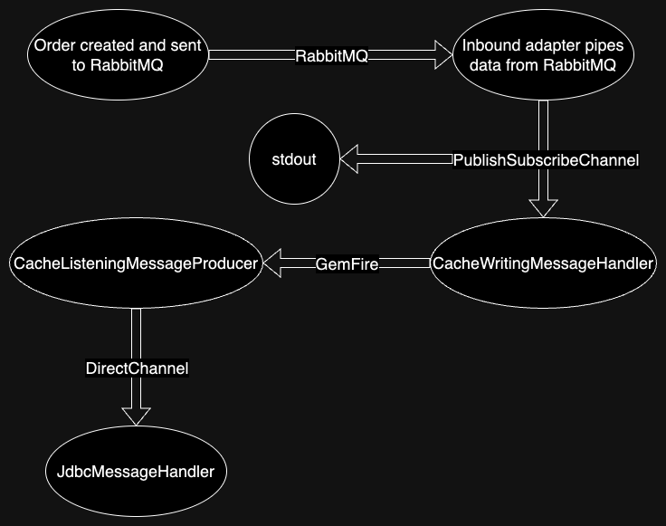

With the recent release of Spring Integration for GemFire, you may be wondering how you can use it to simplify
integrating GemFire into your data pipelines. This guide will walk you through an example using Spring integration to
tie together RabbitMQ, GemFire, and a Postgres database.

## Supported Versions
Before we begin, we first need to choose a version of Spring Integration for GemFire.
Currently, there are three releases available, all of which are version 1.0.0.
* Spring Integration 6.1 for GemFire 10.0
* Spring Integration 5.5 for GemFire 10.0
* Spring Integration 5.5 for GemFire 9.15

This example uses Spring Integration 6.1 for and GemFire 10.0.

## About the Example
This example consists of only two classes – IntegratorApplication and Order. IntegratorApplication is a Spring Boot
application that drives the example, and Order is a simple domain class representing an order. When the application
starts, we create a queue named “orderQueue” in RabbitMQ. For convenience, we let Spring Boot create an orders region in
GemFire and an orders table in Postgres automatically.

To start our example, there is a scheduled method that creates a randomized Order every two seconds and sends it to the
“orderQueue.” Then, using an adapter supplied by spring-integration-amqp, we get the data from our queue and put it into
a publish-subscribe channel, which will allow the message to be received by multiple subscribers–in this case, allowing
it to be handled and logged to the console while still continuing down our pipeline. The Order will then be processed by
a CacheWritingMessageHandler, which is supplied by spring-integration-gemfire to listen on a channel and write to a
GemFire Region. Next, a CacheListeningMessageProducer is triggered by a new Order being written to GemFire and sends the
new Order to a direct channel – which only allows a single recipient, unlike a publish-subscribe channel – where it is
handled by a JdbcMessageHandler which writes the Order to our Postgres database.

The flow of data looks approximately like this:

## Running the example

### Prerequisites
* JDK 17+
* Docker

*Note: it's possible to complete this guide without Docker if you have GemFire, RabbitMQ, and Postgres installed*

### Steps
1. Clone the [Git repository](https://github.com/gemfire/spring-for-gemfire-examples/) and open the gemfire-rabbit-postgres-integration subproject
2. Ensure that Docker is running on your machine
3. Start a RabbitMQ server
   1. run `docker run -p 5672:5672 -d rabbitmq` to start a RabbitMQ server
4. Start a GemFire cluster
   1. Start Gfsh, GemFire’s CLI, using `docker run -it -e 'ACCEPT_TERMS=y' --rm -p 10334:10334 -p 40404:40404 -p 7070:7070 gemfire/gemfire gfsh`
   2. Inside Gfsh, run:
      1. `start locator --hostname-for-clients=localhost`
      2. `configure pdx --read-serialized=true`
      3. `start server --hostname-for-clients=localhost`
5. Start a Postgres instance
   1. Start Postgres using `docker run --name postgres -e POSTGRES_PASSWORD=postgres -p 5432:5432 -d postgres`
   2. Then, start `psql` with `docker exec -it postgres psql -U postgres` to be able to see your tables and data
6. Run the IntegratorApplication. The application will generate random orders every 2 seconds, and you should see messages printed out saying that the order has been sent to the queue
7. Look at the output for the IntegratorApplication, and you should see the order was received from RabbitMQ
8. Next, query the entries in GemFire’s “orders” region using `query --query="select * from /orders"` from Gfsh. You should see the orders stored in GemFire.
9. Next, go to the psql instance you started earlier and run `select * from orders;` to query the “orders” table and see the orders stored there as well.

This is a basic example that illustrates how to use GemFire as both a consumer and producer of data within Spring Integration and how it can fit in with other technologies like RabbitMQ and Postgres/JDBC.
