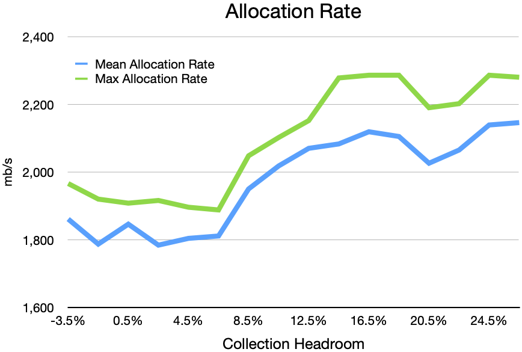
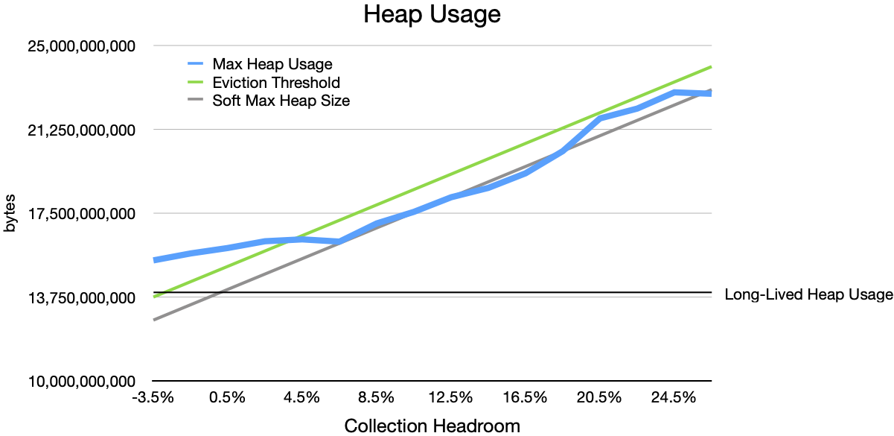
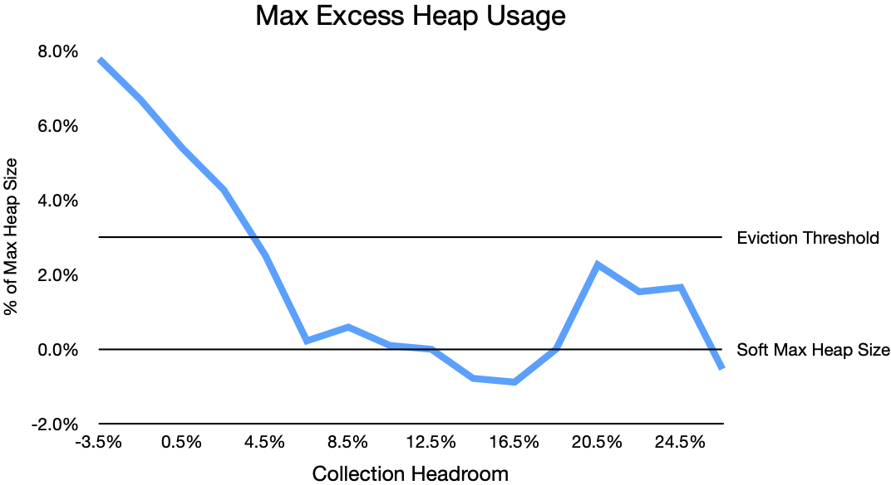
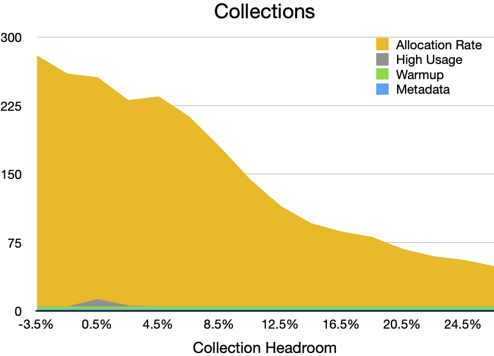
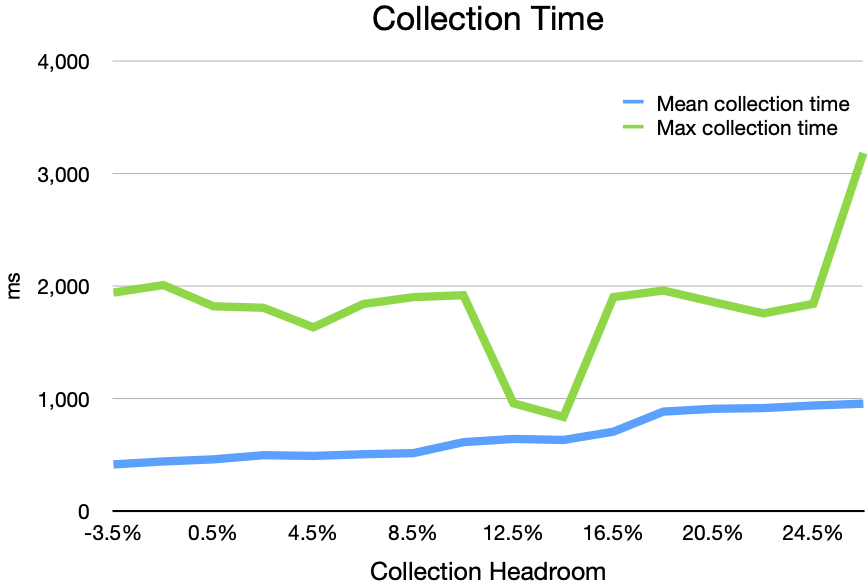
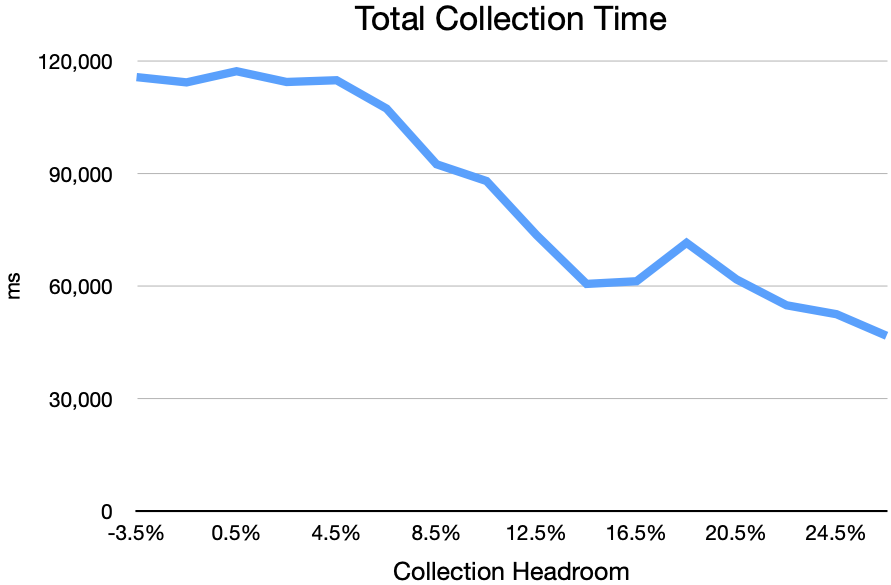
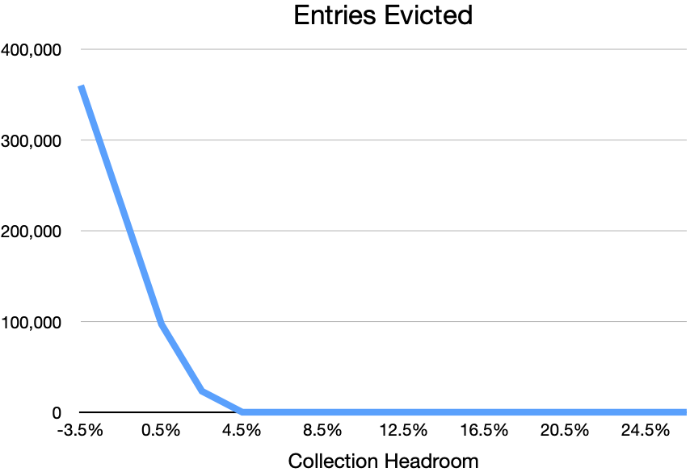
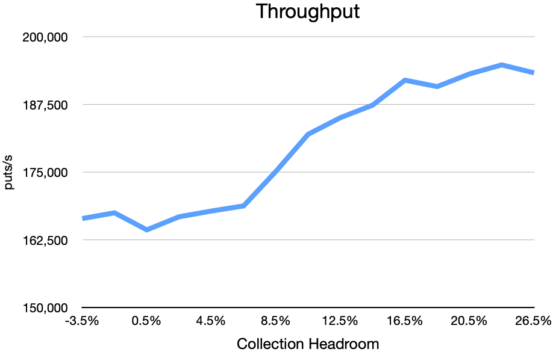

## Terminology
- **Long-lived heap usage:** The amount of heap that GemFire requires in order to hold cached data in memory. This includes the memory used for the data's keys and values, plus the data structures that GemFire uses to maintain the data, plus other long-lived data structures that GemFire uses in order to present its services. Long-lived heap usage does not include the transient objects that GemFire uses to perform a particular operation.
- **Collection headroom:** The difference between long-lived heap usage and `SoftMaxHeapSize`.
- **Eviction safety margin:** The difference between the eviction threshold and `SoftMaxHeapSize`.

## Collection Headroom
Collection headroom is the difference between long-lived heap usage and `SoftMaxHeapSize`. To quantify how collection headroom affects heap usage, operation throughput, and garbage collection performance, I ran a series of scenarios. Each scenario:
1. Starts a GemFire server with a heap size of 32g, and with `SoftMaxHeapSize` set slightly below the eviction threshold (see below).
1. Pre-populates a set of heap LRU regions with enough data to bring long-lived heap usage to about 40% of max heap size. (Actual long-lived heap usage was 40.5%.)
1. Runs 16 threads to perform as many updates as possible for 2 minutes. Each update replaces a randomly selected value in the cache with a new value of the same size (a 10000 byte array). This generates a great deal of garbage while keeping long-lived heap usage essentially constant.

I varied the eviction threshold from 40% to 70%. In each scenario, I set `SoftMaxHeapSize` 3% lower than the eviction threshold.

A few things to note:
- The first few scenarios set `SoftMaxHeapSize` _below_ long-lived heap usage. This is entirely unreasonable, because it clearly makes it impossible for ZGC to keep heap usage below `SoftMaxHeapSize`. But these unreasonable scenarios help quantify what happens when `SoftMaxHeapSize` is very poorly tuned.
- Setting `SoftMaxHeapSize` 3% below the eviction threshold gives an eviction safety margin of only 3%. This is not safe in production. I chose 3% empirically as being just barely adequate to avoid eviction in these highly controlled scenarios, given sufficient collection headroom.

### Allocation Rate (and Garbage Production Rate)

In these scenarios, the barrage of updates allocated memory at a rate of about 2000 mb/s:

Given the nature of the scenarios, every allocation resulted in corresponding garbage. Some allocations were for short-lived objects that would become unreachable as soon as they completed their role in the operation. Other allocations were for new values that would live in the cache, but that replaced existing values, leaving the old values unreachable.

So this graph shows not only the allocation rate, but also the garbage production rate. Each scenario produced a full heap worth of garbage every 16 seconds or so.

### Heap Usage

ZGC has a goal of keeping heap usage safely below `SoftMaxHeapSize`. It can meet this goal only if it has sufficient collection headroom. If the rate of garbage production is high enough, and if `SoftMaxHeapSize` is not far enough above long-lived heap usage, ZGC cannot collect garbage fast enough to keep heap usage safely below `SoftMaxHeapSize`.

Let's rotate the data and look at it in terms of how well (or badly) ZGC met its goal:

In the worst case (the scenarios that gave ZGC a literally impossible job), heap usage exceeded `SoftMaxHeapSize` by at most about 8% of max heap size.

As collection headroom increases, ZGC is increasingly able to collect garbage fast enough to keep heap usage near or below `SoftMaxHeapSize`, even when garbage production is very high.

### Collections

Increasing collection headroom reduces the number of garbage collections, but increases the CPU usage of each collection.

### Eviction Safety

To prevent evictions, `SoftMaxHeapSize` must be set far enough above the long-lived heap usage.

### Throughput

# Observations
- Insufficient collection headroom
	- Very frequent collections
	- Very frequent evictions
- Sufficient collection headroom
	- Once collection headroom rose above 4.5%
		- No further evictions (3% eviction safety margin sufficed)
		- Operation throughput increased more rapidly for a while
		- Total collection time (i.e. CPU usage) decreased more rapidly for a while
			- Number of collections decreased more rapidly
			- Mean collection time increased steadily
		- Max collection time varied

