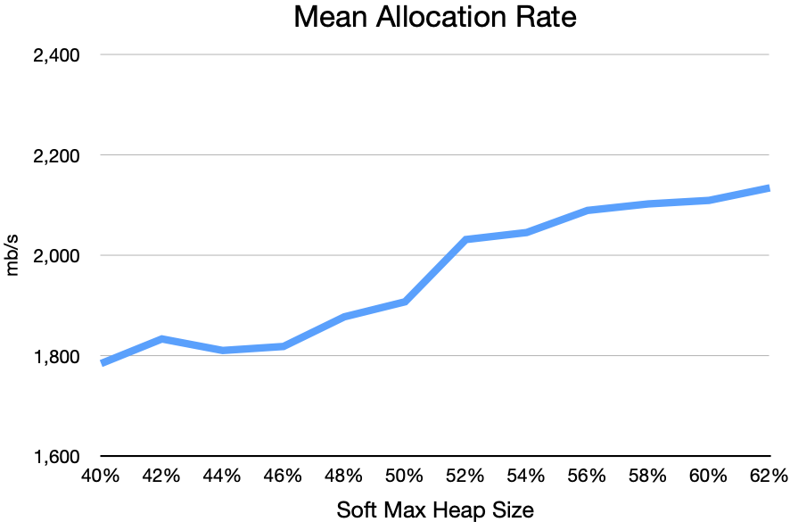
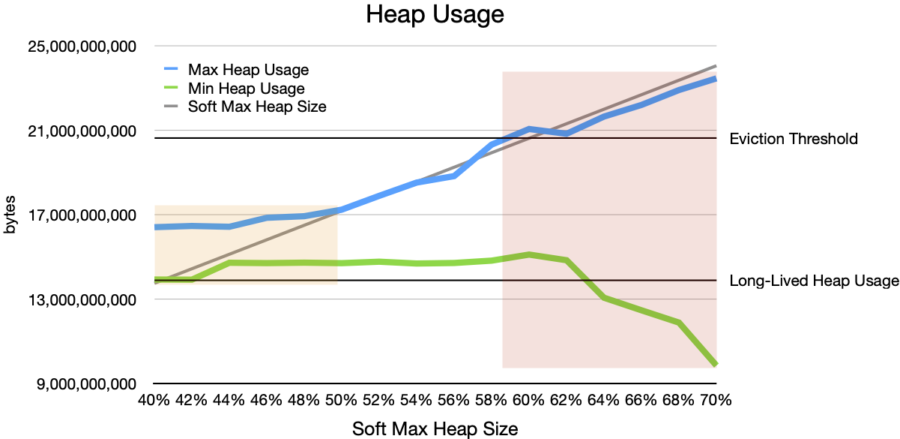
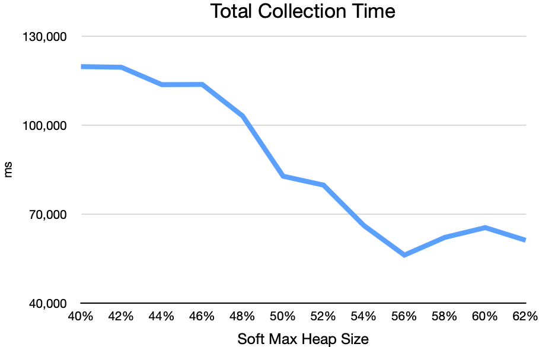
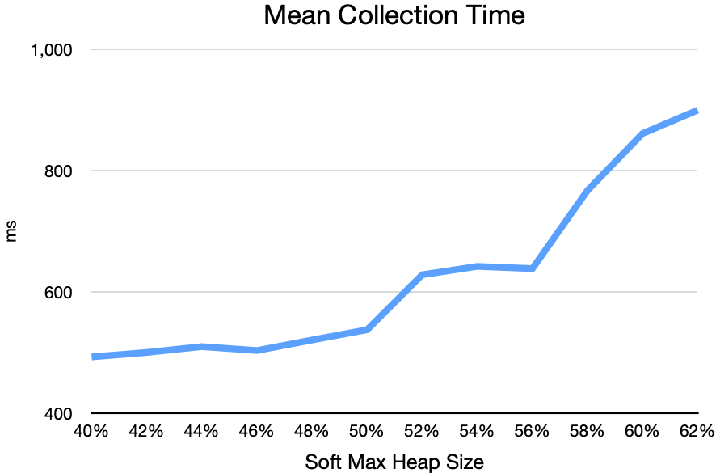

## Introduction
### How Heap LRU Eviction Works
Heap LRU eviction is an algorithm for maintaining cache performance while protecting against the risk of the JVM running out of memory. In VMware GemFire, heap LRU eviction works like this: GemFire monitors heap usage. When heap usage exceeds a user-configured eviction threshold, GemFire evicts entries from memory until heap usage falls back below the threshold.

Every entry evicted from memory increases the chance of a cache miss, which can reduce cache performance. To maintain cache performance, GemFire tries to evict those entries that are the least likely to be used in the near future. To choose which entries to evict, LRU eviction assumes that the least recently used entries are the least likely to be used again in the near future. When the workload satisfies this assumption, evicting the least recently used entries minimizes the chance of a cache miss.

GemFire's heap LRU eviction algorithm relies on the JVM's garbage collector to very quickly collect the memory used by evicted entries. Evicting an entry does not, all by itself, make the entry's memory available for allocation. It merely makes the object and its memory "unreachable." This unreachable memory becomes available for allocation only when the garbage collector collects it. Until the memory from evicted entries is collected, heap usage remains high.

So GemFire prefers to evict only the least recently used entries, and relies on the garbage collector to collect memory from those entries quickly.

### How ZGC Works
Java 17's Z garbage collector (ZGC) works to ensure that any thread that requests memory can get it minimal delay. And ZGC strives to do this with minimal impact on application performance.

If an application thread attempts to allocate more memory than is currently available, ZGC pauses that thread until a garbage collection completes. This pause is called an _allocation stall._ ZGC works very hard to avoid allocation stalls.

Ten times per second, ZGC samples the application's memory allocation rate, then evaluates a series of heuristics to decide whether to initiate garbage collection. One heuristic, the High Usage heuristic, checks whether current heap usage is currently above ZGC's target maximum heap usage, or is close enough to the target to cause concern. Another, the Allocation Rate heuristic, predicts whether heap usage would exceed the target maximum if ZGC didn't begin collecting immediately, given the application's recent allocation requests and ZGC's recent collection performance.

### Heap LRU Eviction and ZGC
When tuned for the purpose, ZGC is well suited for use with heap LRU eviction. Java offers two key JVM options to tune ZGC for this use:
- `-Xmx` sets the JVM's maximum heap size. For a given workload, a larger heap size reduces the chance of allocation stalls, and allows ZGC to work efficiently with fewer worker threads.
- `-XX:SoftMaxHeapSize` sets ZGC's "soft" goal for maximum heap usage. ZGC will strive to keep heap usage below this value, but may allow heap usage to exceed it when necessary. As I will show, setting `SoftMaxHeapSize` lower reduces the risk of eviction, but makes garbage collections more frequent and less efficient.

Another key factor in a well-tuned GemFire system is the workload's _long-lived heap usage:_ The amount of heap that GemFire requires in order to hold cached data in memory. This includes the memory used for the data's keys and values, plus the data structures that GemFire uses to maintain the data, plus other long-lived data structures that GemFire uses in order to present its services. Long-lived heap usage does not include the transient objects that GemFire uses to perform a particular operation.

## Experimenting with SoftMaxHeapSize
To quantify how `SoftMaxHeapSize` affects heap usage, operation throughput, and garbage collection performance, I ran a series of scenarios on a GCP instance with 16 CPUs. Each scenario:
1. Starts a GemFire server with max heap size (`-Xmx`) set to 32g and with GemFire's eviction threshold set to 60%.
1. Pre-populates a set of heap LRU regions with enough total data to bring long-lived heap usage to about 40% of max heap size. The data consisted of 1,205,264 total entries, each holding a 10000 byte array. (Actual measured long-lived heap usage was 40.5%.)
1. Runs 16 threads to perform as many updates as possible for 2 minutes. Each update replaces a randomly selected value in the cache with a new value of the same size (a 10000 byte array). This generates a great deal of garbage (about 2g per second) while keeping long-lived heap usage essentially constant.

I varied `SoftMaxHeapSize` from 40%, just below long-lived heap usage, to 70%, well above the eviction threshold.

**Experiments, Not Benchmarks.**
I ran these scenarios as experiments, not as benchmarks. Each scenario uses 16 client threads running in a separate JVM but on the same GCP instance as the GemFire server. And several other minor processes coordinate the experiments. The results demonstrate general effects and trends, but should not be taken as an absolute measure of performance.

**Garbage Production Rate.**
In these scenarios, the barrage of updates allocates memory at a rate of about 2000 mb/s:

Given the nature of the scenarios, every allocation results in corresponding garbage. Some allocations are for new values that will live in the cache, but that replace existing values, leaving the old values unreachable. The remaining allocations are for short-lived objects that will become unreachable as soon as they complete their role in the operation.

So the _Mean Allocation Rate_ graph shows not only the allocation rate, but also the garbage production rate. Each scenario produces a full heap worth of garbage (32g) every 16 seconds or so.

### Heap Usage
The _Heap Usage_ graph shows the minimum and maximum heap usage during the "barrage of updates" phase of each scenario, as measured by ZGC's memory manager:

#### Collection Headroom
ZGC tries to keep heap usage below `SoftMaxHeapSize`. As the _Heap Usage_ graph shows, ZGC can meet this goal only if it has sufficient _collection headroom:_ the difference between `SoftMaxHeapSize` and long-lived heap usage.

The orange zone on the left side of the graph shows what happens if the collection headroom is too low, given the rate of garbage production: ZGC cannot collect garbage fast enough to keep heap usage below `SoftMaxHeapSize`.

Note that the first scenario sets `SoftMaxHeapSize` to 40% of max heap size. This is _below_ the long-lived heap usage (40.5% of max heap size). Having _negative_ collection headroom makes it impossible for ZGC to keep heap usage below `SoftMaxHeapSize`. Even in this impossible scenario, heap usage exceeded `SoftMaxHeapSize` by at most about 8% of max heap size.

As `SoftMaxHeapSize` increases, ZGC is increasingly able to keep heap usage near or below `SoftMaxHeapSize`.

#### Eviction Headroom
GemFire's heap LRU eviction algorithm tries to keep heap usage below the eviction threshold. To meet this goal, it will evict entries from memory if necessary.

To avoid evictions, the system needs sufficient _eviction headroom:_ the difference between the eviction threshold and `SoftMaxHeapSize`.

Each scenario generates garbage at a rapid pace, relentlessly pushing heap usage upward. If `SoftMaxHeapSize` is set far enough below the eviction threshold, this upward pressure on heap usage triggers garbage collections in plenty of time to avoid evictions.

If `SoftMaxHeapUsage` is set too high (above or too close to the eviction threshold), we see the result shown in the red zone on the right side of the _Heap Usage_ graph: By the time heap usage triggers a collection, GemFire has already evicted numerous entries. The number of entries evicted depends on how often heap usage rises above the eviction threshold and how long it stays there. With `SoftMaxHeapSize` set to 70% and the eviction threshold set to 60%, GemFire evicted nearly 600,000 entries (about half of the entries in the cache) in two minutes.

**Insufficient Collection Headroom.**
Here's what heap usage looks like during "negative collection headroom" scenario:

The red line shows current heap usage as collected by GemFire's statistics sampler. The blue line shows "collection usage," the amount of heap in use at the end of the most recent garbage collection cycle. The straight brown line at the top of the graph shows the eviction threshold.

**Insufficient Eviction Headroom**

**Sufficient Collection Headroom and Eviction Headroom**

### Throughput
As `SoftMaxHeapSize` rises, application throughput rises (puts per second):

In these scenarios, 16 threads performed fixed-size puts as fast as possible for 2 minutes. Note that these client threads executed in a separate JVM, but on the same GCP instance as the GemFire server. So these client threads competed with both the server and ZGC for the instance's 16 CPUs.

The throughput curve is subtly S-shaped, with a slightly higher slope in the middle of the graph than at either end. When `SoftMaxHeapSize` is set too low, the garbage collection tasks interfere with performance, keeping throughput slightly flatter on the left side of the graph. The graph also flattens subtly at the right side of the graph, perhaps suggesting that throughput is approaching some unidentified limit.

### Collections

**NOTE:**
- These collection times are clock time, not CPU time. So they do not take the number of workers into account.
- Everything I say about CPU time below is incorrect.

When `SoftMaxHeapSize` is too low, and ZGC does not have enough collection headroom, ZGC triggers garbage collections at the rate of 2 per second. The total CPU time used by these collections is 2 minutes, which means that the scenario keeps 1 of the instance's 16 CPUs busy for the entire 2 minutes.

As `SoftMaxHeapSize` rises, each collection takes more time, but the frequency of collections falls faster than mean collection time rises. As a result, total collection time drops to about 60 seconds, consuming about half of a CPU on average over the 2 minutes.

## ZGC Allocation Rate Quirk
ZGC's heuristics tend to be pessimistic about both allocation rate and garbage collection duration. They assume that the actual allocation rate will usually be higher than recently measured, and the collection time will usually be longer. This pessimism usually allows ZGC to keep actual heap usage safely below its target maximum.

There is a specific, uncommon circumstance that can fool ZGC into briefly under-performing: A long period of low allocation rate followed by a sudden long period of very high allocation rate. If ZGC samples the allocation rate just as it begins to rise, the Allocation Rate heuristic can significantly under-predict the impending allocation rate. When this happens, ZGC can start a collection that uses too few threads, resulting in a collection task that is too slow to handle the actual, unexpectedly high allocation rate.

Even when ZGC's next sample measures the now-higher allocation rate, it will not start a interrupt or adjust the in-progress collection, which will continue with its too few worker threads until it finishes.

The scenarios in my experiments often create this peculiar circumstance.