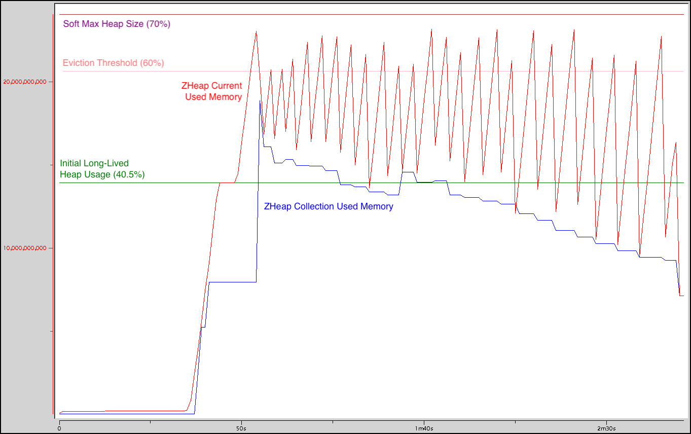

## Introduction
VMware GemFire offers a heap LRU eviction algorithm to maintain cache performance while protecting against the risk of the JVM running out of memory. Java 17's Z garbage collector (ZGC), when tuned for use with heap LRU eviction, works beautifully with GemFire to maximize cache performance.

### How Heap LRU Eviction Works
Heap LRU eviction is an algorithm for maintaining cache performance while protecting against the risk of the JVM running out of memory. In VMware GemFire, heap LRU eviction works like this: GemFire continually monitors heap usage. When heap usage exceeds a user-configured threshold, GemFire evicts eligible entries from memory until heap usage falls back below the threshold.

Every entry evicted from memory increases the chance of a cache miss, which can reduce cache performance. To maintain cache performance, GemFire tries to evict the entries that are the least likely to be used in the near future. To choose which entries to evict, LRU eviction assumes that the least recently used entries are the least likely to be used again in the near future. When the workload satisfies this assumption, evicting the least recently used entries minimizes the chance of a cache miss.

GemFire's heap LRU eviction algorithm relies on the JVM's garbage collector to very quickly collect the memory used by evicted entries. Evicting an entry does not, all by itself, make the entry's memory available for allocation. It merely makes the object and its memory "unreachable." This unreachable memory becomes available for allocation only when the garbage collector collects it. Until the memory from evicted entries is collected, heap usage remains high.

### How ZGC Decides When to Collect Garbage
**ZGC Goals.** ZGC works to ensure that any thread that requests memory can get it with minimal delay. If an application thread attempts to allocate more memory than is currently available, ZGC pauses that thread until a garbage collection completes. This pause is called an _allocation stall._ ZGC works very hard to avoid allocation stalls, and to do this with minimal impact on application performance.

**ZGC Decision Rules.** Ten times per second, ZGC samples the application's heap usage and memory allocation rate, then applies seven rules to decide whether to initiate garbage collection. One rule, the High Usage rule, checks whether heap usage is above ZGC's target maximum heap usage, or is close enough to the target to cause concern. Another, the Allocation Rate rule, predicts whether the application is likely to run out of available heap memory if ZGC does not intervene immediately.

### Tuning ZGC for Use with Heap LRU Eviction
When tuned for the purpose, ZGC is well suited for use with heap LRU eviction. To tune ZGC well, you will need to know some key characteristics of your workload, and the key tuning knobs at your disposal.

**Workload heap usage.** To tune ZGC well, you will need to know several key characteristics of your workload's heap usage:
- **Long-lived heap usage:** The amount of heap that GemFire requires in order to hold cached data in memory. This includes the memory used for the data's keys and values, plus the data structures that GemFire uses to maintain the data, plus other long-lived data structures that GemFire uses in order to present its services. Long-lived heap usage does not include the short-lived objects that GemFire uses to perform a particular operation.
- **Live set size:** The amount of heap used by all live objects. This includes long-lived objects and any short-lived objects currently in use. Over time, GemFire's ZHeap Collection Used Memory statistic gives an approximation of live set size.

**ZGC tuning knobs.** Java offers two key JVM options to tune ZGC for use with heap LRU eviction:
- **`-Xmx`:** The JVM's maximum heap size. For a given workload, a larger heap size reduces the chance of allocation stalls, and allows ZGC to work efficiently with fewer worker threads.
- **`-XX:SoftMaxHeapSize`:** ZGC's "soft" limit for maximum heap usage. ZGC will strive to keep heap usage below this limit, but may allow heap usage to exceed it when necessary. As I will show, setting `SoftMaxHeapSize` lower reduces the risk of eviction, but makes garbage collections more frequent and less CPU-efficient. Setting it higher reduces ZGC's CPU consumption, but increases the risk of eviction.

**GemFire tuning knobs.** GemFire's primary tuning knob for governing heap LRU eviction is:
- **`--eviction-heap-percentage`:** GemFire's target heap usage threshold, expressed as a percentage of max heap size. Whenever heap usage exceeds this threshold, GemFire evicts entries to bring heap usage down.

## Experimenting with SoftMaxHeapSize
To understand how `SoftMaxHeapSize` affects heap usage, operation throughput, and garbage collection performance, I ran a series of scenarios on a GCP instance with 16 CPUs. Each scenario:
1. Starts a GemFire server with max heap size (`-Xmx`) set to 32g and with GemFire's eviction threshold set to 60%.
1. Pre-populates a set of heap LRU regions with enough total data to bring long-lived heap usage to about 40% of max heap size. The data consisted of 1,205,264 total entries, each holding a 10000 byte array. (Actual measured long-lived heap usage was 40.5%.)
1. Runs 16 threads to perform as many updates as possible for 2 minutes. Each update replaces a randomly selected value in the cache with a new value of the same size (a 10000 byte array). This _sustained updates_ phase generates a great deal of garbage (about 2g per second) while keeping long-lived heap usage essentially constant.

I varied `SoftMaxHeapSize` from 40%, just below long-lived heap usage, to 70%, well above the eviction threshold.

**Experiments, not benchmarks.** I ran these scenarios as experiments, not as benchmarks. Each scenario uses 16 client threads running in a separate JVM but on the same GCP instance as the GemFire server. And several other minor processes coordinate the experiments. The results demonstrate general effects and trends, but should not be taken as an absolute measure of performance.

These scenarios generate an unusually uniform workload. In a production environment, the workload will be far more variable.

**Garbage production rate.** In these scenarios, the sustained updates phase allocates memory at [a rate of about 2000 mb/s](images/long-lived-40-allocation-rate.png).

Given the nature of the scenarios, every allocation results in corresponding garbage. Some allocations are for new values that will live in the cache, but that replace existing values, leaving the old values unreachable. The remaining allocations are for short-lived objects that will become unreachable as soon as they complete their role in the operation.

This means that the measured allocation rate is also the garbage production rate. Each scenario produces a full heap worth of garbage (32g) every 16 seconds or so.

### How SoftMaxHeapSize Affects Heap Usage
The _Heap Usage_ graph shows the minimum and maximum heap usage during the sustained updates phase of each scenario, as measured by ZGC's memory manager:

The colored zones highlight different patterns of performance. In the green zone, ZGC is able to keep heap usage below or near its target `SoftMaxHeapSize`, and the system is able to avoid eviction. In the orange zone, ZGC is unable to meet its `SoftMaxHeapSize` target despite collecting garbage constantly, consuming every CPU cycle available to it. In the red zone, despite ZGC keeping heap usage below or near `SoftMaxHeapSize`, GemFire evicts many entries from memory.

Two key factors govern which performance pattern the system exhibits:
- **Collection headroom:** The difference between `SoftMaxHeapSize` and the live-set size.
- **Eviction headroom:** The difference between the eviction threshold and `SoftMaxHeapSize`.

Note that even in the green zone, ZGC may need to perform many expensive garbage collections to keep heap usage at or below `SoftMaxHeapSize`. Later we will see that as `SoftMaxHeapSize` increases from the left side of the green zone to the right, ZGC's performance improves steadily, consuming fewer and fewer CPU cycles.

#### Collection Headroom
ZGC tries to keep heap usage below `SoftMaxHeapSize`. When it has enough collection headroom, as in the green and red zones on the graph, ZGC is able to meet this goal.

In the orange zone, collection headroom is too low. Given the rate of garbage production and the live objects maintaining the cache and performing operations, ZGC cannot collect garbage fast enough to keep heap usage below `SoftMaxHeapSize`.

Note that the first scenario sets `SoftMaxHeapSize` to 40% of max heap size. This is not only below the live-set size (approximated by the green line), but also below long-lived heap usage (40.5% of max heap size). Having _negative_ collection headroom clearly makes it impossible for ZGC to keep heap usage below `SoftMaxHeapSize`. Even in this impossible scenario, heap usage exceeded `SoftMaxHeapSize` by at most about 8% of max heap size.

#### Eviction Headroom
GemFire's heap LRU eviction algorithm tries to keep heap usage below the eviction threshold. To meet this goal, it will evict eligible entries from memory when necessary.

To avoid evictions, the system needs eviction headroom. Each scenario generates garbage at a rapid pace, relentlessly pushing heap usage upward. Given enough eviction headroom, as in the orange and green zones, ZGC responds to the upward pressure in plenty of time to avoid evictions.

In the red zone, eviction headroom is too low. As heap usage rises, it crosses the eviction threshold before it hits `SoftMaxHeapSize`. By the time the rising heap usage triggers a collection, GemFire has already evicted numerous entries. The number of entries evicted depends on how often heap usage rises above the eviction threshold and how long it stays there. With `SoftMaxHeapSize` set to 70% and the eviction threshold set to 60%, GemFire evicted nearly 600,000 entries (about half of the entries in the cache) in two minutes.

### Patterns of Heap Usage
Once per second, GemFire samples many statistics, including ZHeap Current Used Memory (self-explanatory) and ZHeap Collection Used Memory, the amount of memory in use at the end of the most recent garbage collection cycle. ZHeap Collection Used Memory gives a reasonable approximation of live-set size, though it will also include any garbage that was generated during the most recent garbage collection cycle.

Let's look at how heap usage is affected by different settings of `SoftMaxHeapSize`, relative to the eviction threshold and the live-set size.

#### Insufficient Collection Headroom
Here's what heap usage looks like when ZGC is not given enough collection headroom:

Current usage never strays far from collection usage. This is a sign of insufficient collection headroom. Because memory usage remains above `SoftMaxHeapSize` during the entire sustained updates phase, ZGC collects garbage continuously.

#### Insufficient Eviction Headroom
The heap usage pattern is very different when `SoftMaxHeapSize` is set  above the eviction threshold:

In this scenario, ZHeap Current Used Memory shows frequent excursions above the eviction threshold. The result is that GemFire evicts entries from memory. As entries are evicted and collected, the live-set size decreases, as reflected in the declining ZHeap Collection Used Memory.

As we will see, collections are far less frequent in this scenario compared to the "insufficient collection headroom" scenario described above. But the cost is that many entries are evicted, increasing the likelihood of cache misses.

#### Sufficient Collection Headroom and Eviction Headroom
In this scenario, `SoftMaxHeapSize` is set well below the eviction threshold and well above the live-set size:

This gives the system sufficient collection headroom below `SoftMaxHeapSize` and sufficient eviction headroom above. Tuned in this way, ZGC keeps heap usage well away from the eviction threshold, allowing the system to avoid eviction. And it is able to do this with relatively infrequent garbage collections.

Note that the requirements for eviction headroom and collection headroom depend highly on the nature of your workload. You will have to experiment to determine the requirements for your environment.

### How SoftMaxHeapSize Affects Throughput
As `SoftMaxHeapSize` rises, application throughput rises (puts per second):

In each scenario, 16 client threads performed fixed-size puts as fast as possible for 2 minutes. Note that though the client and server executed in separate JVMs, they both ran on the same GCP instance. So the client threads competed with the server's operation threads and ZGC threads for the instance's 16 CPUs.

The throughput curve is slightly S-shaped, with a slightly higher slope in the middle of the graph than at either end. When `SoftMaxHeapSize` is set too low, the garbage collection tasks interfere with performance, keeping throughput slightly flatter on the left side of the graph. On the right side of the graph, the slope decreases slightly as collection CPU utilization asymptotically approaches 0.

When ZGC has insufficient collection headroom, it collects garbage more often and assigns more threads to the garbage collection tasks. In the scenarios where collection headroom was lowest, ZGC kept 4 CPUs busy at nearly all times. This is the maximum number of CPUs that ZGC will assign by default on a 16 CPU host.

If we subtract the number of CPUs busy doing garbage collection from the total number of CPUs (16), we get the number of CPUs available for other tasks:

This graph has essentially the same shape as the throughput graph. The lesson is clear: To maximize throughput, give ZGC plenty of collection headroom.

### How SoftMaxHeapSize Affects Garbage Collection Performance
As collection headroom increases, the frequency of garbage collections drops:

In the scenarios where collection headroom is too low, ZGC performs garbage collections at the rate of 2 per second.

At the same time, the mean CPU consumption of each collection also drops, even as the garbage production rate rises:

## Summary
Setting `SoftMaxHeapSize` higher creates more collection headroom, making ZGC more efficient at collecting garbage, but at the risk of triggering GemFire to evict entries from memory.

Setting `SoftMaxHeapSize` lower creates more eviction headroom, decreasing the risk of eviction, but at the cost of making garbage collection more frequent and more costly.

The more collection headroom the system has, the more efficient ZGC's garbage collections will be. The more eviction headroom the system has, the better able GemFire will be to avoid evicting entries from memory.

Along with max heap size, ZGC's `SoftMaxHeapSize` JVM option is a key tuning knob to maximize cache performance by avoiding eviction and reducing the cost of garbage collections.

If your GemFire clusters use heap LRU eviction, now is the time to take a closer look at Java 17 and ZGC.
