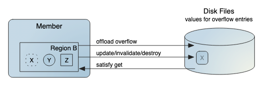
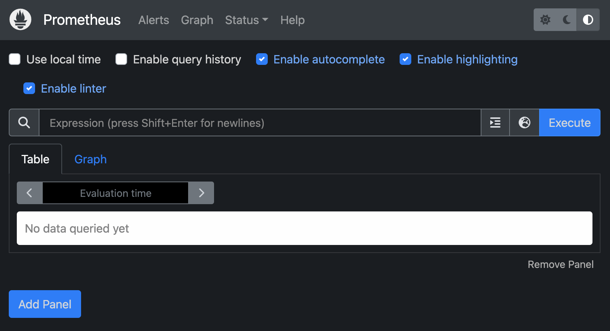
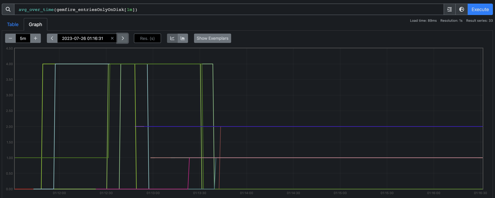

In this guide, you'll learn how to set up a VMware GemFire cluster on Kubernetes, utilizing an autoscaler driven by custom metrics from GemFire statistics


# Introduction

Integrating GemFire with Kubernetes simplifies deployment and offers more robust availability with self-healing, automated data redundancy, and data rebalancing. With the release of VMware GemFire for Kubernetes 2.3, we've added automated cluster scaling using a [HorizontalPodScaler](https://kubernetes.io/docs/tasks/run-application/horizontal-pod-autoscale/) (HPA). This allows a hands-off way to automatically scale the number of servers in your GemFire cluster based on their average CPU utilization or other custom-defined metrics. For example, GemFire can properly scale to handle peaks and valleys in throughput, network, disk space, and more. So long as one can describe their scenario using available [GemFire statistics](https://docs.vmware.com/en/VMware-GemFire/10.0/gf/reference-statistics_list.html), then the HPA can scale the cluster without human intervention.

 Our out-of-the-box HPA can scale by monitoring the CPU utilization on all the servers in the GemFire for Kubernetes cluster. In this guide, we'll go step-by-step in defining a custom metric from the many available GemFire statistics for the HPA to use. We'll start with preparing our Kubernetes cluster with [Prometheus](https://prometheus.io/), and [Prometheus Adapter](https://github.com/kubernetes-sigs/prometheus-adapter), configure the adapter with a custom metric definition, and finally start and configure a GemFire for Kubernetes cluster and demo the HPA. Our contrived GemFire cluster will have a single region configured to write entries to disk when the number of region entries is above 2. The HPA will monitor a GemFire statistic counting the number of entries on disk and scale the cluster in response to adding or deleting region data.


*GemFire configured to offload data to disk*

# Step by Step Guide

Ensure you have access to an environment that satisfies GemFire for Kubernetes prerequisites.
* [GemFire for Kubernetes Prerequisites and Supported Platforms](https://docs.vmware.com/en/VMware-GemFire-for-Kubernetes/2.3/gf-k8s/supported-configurations.html)

## Install Prometheus server

By default, GemFire cluster members have a Prometheus endpoint that hosts 203 metrics that update at a 1 minute interval. To emit these metrics as time-series data for the HPA, install Prometheus on the Kubernetes cluster.

```bash
$ helm repo add prometheus-community https://prometheus-community.github.io/helm-charts
$ helm repo update
$ helm install prometheus prometheus-community/prometheus
```

To confirm Prometheus installed correctly, view the Prometheus UI by executing

```bash
$ export POD_NAME=$(kubectl get pods --namespace default -l "app.kubernetes.io/name=prometheus,app.kubernetes.io/instance=prometheus" -o jsonpath="{.items[0].metadata.name}")
```

After the Prometheus server pod is running, execute

```bash
$ kubectl --namespace default port-forward $POD_NAME 9090
```

Then visit the UI from a browser at http://localhost:9090/, which will look like



  *Prometheus UI, note that the UI is a helpful way of experimenting with different Expressions you may use for the HPA*

## Install Prometheus Adapter
The Prometheus adapter is required as it implements the Kubernetes Custom Metrics API which integrates seamlessly with the HPA.

To install Prometheus Adapter, execute
```bash
$ helm install prometheus-adapter prometheus-community/prometheus-adapter
```

Note that depending on your environment you may need to edit the `prometheus-adapter` deployment and enter the correct url for the Prometheus server, for example

```bash
$ kubectl edit deployment prometheus-adapter
```

Locate the `--prometheus-url` field and enter the correct DNS for the Prometheus server service

```bash
--prometheus-url=http://prometheus-server.default.svc.cluster.local:80
```

### Configuring Prometheus Adapter

As mentioned before, the HPA will monitor the number of entries overflowed to disk. After consulting the [available GemFire statistics](https://docs.vmware.com/en/VMware-GemFire/10.0/gf/reference-statistics_list.html), the metric `entriesOnlyOnDisk` best suites our needs. Along with reporting the entries on disk, the published Prometheus metric includes metadata like associated region, gemfire member, and node as shown in the `entriesOnlyOnDisk` sample below

```json
{
  app_kubernetes_io_component="gemfire-server", 
  app_kubernetes_io_instance="gemfire-cluster", 
  app_kubernetes_io_name="gemfire", 
  category="DiskRegionStatistics", 
  controller_revision_hash="gemfire-cluster-server-9465f4bbf", 
  gemfire_vmware_com_app="gemfire-cluster-server", 
  instance="/test-region", 
  job="kubernetes-pods", 
  member="gemfire-cluster-server-1(gemfire-cluster-server-1:1)<v3>:56065", 
  namespace="default", 
  node="gke-test-gemfire-cluster-default-pool-4432050e-p2pj", 
  pod="gemfire-cluster-server-1", 
  statefulset_kubernetes_io_pod_name="gemfire-cluster-server-1"
  }
```

Next, configure the Prometheus Adapter to consume `gemfire_entriesOnlyOnDisk`, perform a time-series average, and re-emit the new average metric as `gemfire_entriesOnlyOnDisk_avg`.

By default the Prometheus Adapter will use the `ConfigMap` named `prometheus-adapter` deployed to the same namespace. Overwrite this `ConfigMap` using the configuration shown below


```yaml
// adapter-config.yaml
apiVersion: v1
kind: ConfigMap
metadata:
  name: prometheus-adapter
data:
  config.yaml: |-
    "rules":
    - "seriesQuery": |
         {namespace!="",__name__="gemfire_entriesOnlyOnDisk",instance="/test-region"}
      "resources":
        "template": "<<.Resource>>"
      "name":
        "matches": "^(.*)"
        "as": "gemfire_entriesOnlyOnDisk_avg"
      "metricsQuery": avg_over_time(gemfire_entriesOnlyOnDisk[1m])
```

In this configuration, the `rules.seriesQuery` field is used to match metadata for the metrics from the Prometheus server. For example, the specified query will return a metric whose name matches `gemfire_entriesOnlyOnDisk` from a region named `test-region`. 

The new metric is specified by the `rules.metricsQuery` field (`metricsQuery` is written using [PromQL](https://prometheus.io/docs/prometheus/latest/querying/basics/)). Here `gemfire_entriesOnlyOnDisk` from `test-region` will be time-averaged for 1 minute and re-emitted with the name `gemfire_bytesOnlyOnDisk_avg` as specified in the `name.as` field. Note that custom metrics can be defined using a combination of `metricsQuery` and `seriesQuery` that can describe many scenarios of interest.

Deploy the new `prometheus-adapter` `ConfigMap` by executing

```bash
$ kubectl apply -f adapter-config.yaml
```

In lieu of hot-reloading the `ConfigMap`, the `prometheus-adapter` `Pod` needs to be manually killed to load the new configuration.

```bash
$ export POD_NAME=$(kubectl get pods --namespace default -l "app.kubernetes.io/name=prometheus-adapter,app.kubernetes.io/instance=prometheus-adapter" -o jsonpath="{.items[0].metadata.name}")
$ kubectl delete pod $POD_NAME --grace-period=0 --force
```

## Deploy GemFireCluster with HPA Custom Metric

To enable HPA in the GemFire cluster, complete the new section of the GemFireCluster CRD `spec.autoscaler`. Under this section, include the new metric being emitted as `gemfire_bytesOnlyOnDisk_avg` under the `metrics` field as shown below. Note that the HPA can be configured to monitor several metrics at the same time; only the custom metric will be monitored here.

```yaml
// gemfire-cluster-hpa.yaml
apiVersion: gemfire.vmware.com/v1
kind: GemFireCluster
metadata:
  name: gemfire-cluster
spec:
  image: "registry.tanzu.vmware.com/pivotal-gemfire/vmware-gemfire:10.0.0"
  servers:
    replicas: 3
  autoscaler:
    behavior:
      scaleDown:
        policies:
        - periodSeconds: 1
          type: Pods
          value: 1
        stabilizationWindowSeconds: 1
    maxReplicaCount: 15
    minReplicaCount: 1
    metrics:
    - type: Pods
      pods:
        metric:
          name: gemfire_entriesOnlyOnDisk_avg
        target:
          type: AverageValue
          averageValue: "0.1"
```


For this example, the configured HPA will scale to as few as 1 server replicas and up to 15 server replicas and be allowed to scale up and down quickly, setting 1 second for both the stabilization window and per-pod period in the scale down policy. In production systems, these values, along with average of the metric (as in `gemfire_entriesOnlyOnDisk_avg`) need to be chosen carefully to prevent uneccessary scaling and data loss due to not having adequate time for rebalance or redundancy operations to finish.

Finally, `averageValue` for the GemFire cluster servers is chosen as `0.1`, which will be used by the HPA to recommend replicas.

```
recommendedReplicas = ceil[currentReplicas * (currentMetricValue / desiredMetricValue )] 
= ceil[currentReplicas * ( currentMetricValue / 0.1 )]
```

In this example, as data is added to the region the HPA will quickly recommend max replicas (because `averageValue` is set to a small number) and scale the GemFire cluster to 15 servers. Conversely, after the region is deleted the HPA will recommend min replicas and scale the GemFire cluster down to 1 server.

To deploy the GemFire cluster, execute
```bash
kubectl apply -f gemfire-cluster-hpa.yaml
```

## HPA Scaling Demo

When the GemFire cluster is running, exec into the locator pod to begin creating the region.

#### Connecting to the cluster
```bash
$ kubectl exec -it gemfire-cluster-locator-0 /bash

# Once in, start gfsh and connect to the cluster
$ gfsh

gfsh> connect --locator=<LOCATOR_FQDN>[10334] --security-properties-file=/security/gfsecurity.properties
```
Where `LOCATOR_FQDN` is the locator's fully qualified domain name.

#### Creating the region

The region will be configured with data eviction and an eviction policy of `overflow-to-disk`.  After the region has 2 entries, the following entries will be written to disk. See [Configure Data Eviction](https://docs.vmware.com/en/VMware-GemFire/10.0/gf/developing-eviction-configuring_data_eviction.html) for more information on data eviction.

To create the region, execute

```bash
gfsh> create region --name=test-region --type=PARTITION --eviction-entry-count=2 --eviction-action=overflow-to-disk
```

#### Putting region entries to overflow to disk

Next, execute many puts to overflow entries to disk. Shown below is a helper bash script to generate a `gfsh` script that will repeatedly 'put' data into the region.
```bash
// put.sh
echo 'connect --locator=<LOCATOR_FQDN>[10334] --security-properties-file=/security/gfsecurity.properties' > put.gfsh

for i in $(seq 1 10)
do
  echo "put --key=$i --value=$i --region='test-region'" >> put.gfsh
done
```
On the locator, run the `gfsh` script by executing

```bash
$ gfsh run --file=put.gfsh
```

#### Observe HPA Scaling

After some initialization time, the HPA will begin recieving updates to `gemfire_entriesOnlyOnDisk_avg` on `test-region` and start making recommendations for server replicas. As mentioned above, the likeliest first recommendation from the HPA will be max replicas and soon after the GemFire cluster will finish scaling up, as shown below

```bash
$ kubectl get hpa gemfire-cluster-horizontal-pod-autoscaler

# NAME                                        REFERENCE                            TARGETS   MINPODS   MAXPODS   REPLICAS   AGE
# gemfire-cluster-horizontal-pod-autoscaler   StatefulSet/gemfire-cluster-server   1/500m    1         15        15         17m
```



*Prometheus UI showing the custom metric during scale up before settling to an average of 1 entry on disk across the cluster. Each line is a different GemFire cluster server*


To have the HPA scale the cluster back down, simply delete the region and the HPA will begin eliminating one pod at a time (as specified by `autoscaler.behavior.scaleDown.policies.value: 1` in the GemFireCluster yaml).

```bash
gfsh> destroy region --name=test-region
```

Soon the GemFire cluster will be scaled down to 1 server, as shown below

```bash
$ kubectl get hpa gemfire-cluster-horizontal-pod-autoscaler

# NAME                                        REFERENCE                            TARGETS   MINPODS   MAXPODS   REPLICAS   AGE
# gemfire-cluster-horizontal-pod-autoscaler   StatefulSet/gemfire-cluster-server   0/500m    1         15        1         24m
```

# Conclusion

With VMware GemFire for Kubernetes 2.3, users now have the ability to autoscale GemFire clusters based on CPU utilization and custom metrics. The integrated HorizontalPodScaler can respond to throughput spikes, disk space and memory utilization, and more by leveraging GemFire's extensive statistics. While this guide covers the fundamentals of configuration, more advanced setups using multiple metrics at once could be created to address a variety of scenarios.
